### 什么是J.U.C

##### JUC是java.util.concurrent包的缩写，包结构如下，说白了就是并发场景进行多线程编程的工具类。

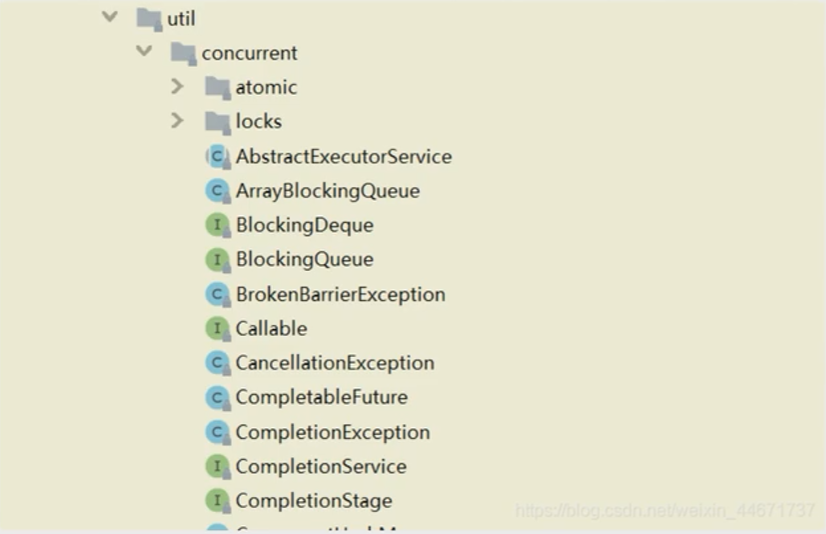

##### 我总结 JUC就是在并发场景下，怎么让程序尽量通过有限的硬件，高效的处理请求，并且保证程序“线程安全”而这涉及到的知识非常的庞大。

### 进程、线程、纤程（协程或虚拟线程）


##### 什么是进程？

##### 专业说法：在操作系统中，进程是基本的资源分配单位，操作系统通过进程管理计算机的资源，如CPU、内存、磁盘等。每个进程都有一个唯一的进程标识符（PID），用于区分不同的进程。

##### 什么是线程？

##### 底层角度：线程是操作系统中的基本执行单元（能够直接执行的最小代码块），它是进程中的一个实体，是CPU调度和分派的基本单位。**一个进程可以包含多个线程，每个线程都可以独立执行不同的任务，但它们共享进程的资源。**

##### 同一时刻，一个CPU核心只能运行一个线程，也就是CPU内核和同时运行的线程数是1：1的关系，也就是说8核CPU同时可以执行8个线程的代码。

##### 什么是纤程（协程）？

##### 底层角度：

##### 1.纤程可以在内部创建多个纤程，这些纤程之间可以共享同一个线程资源

##### 2.纤程是在同一个进程內部运行的，不需要操作系统介入，可以用户空间内实现协作式多任务处理。因此纤程的创建和销毁开销很小，可以更高效地利用系统资源。

##### 通俗角度：通俗地说，如果线程是饭桌，协程就是座椅。

##### Java19才支持虚拟线程（纤程）

##### 或者使用第三方协程库quasar（据说这个大神已经入职oracle了，并且正式java的虚拟线程的开发者。）

#### 总结

##### 1）先有进程，然后进程可以创建线程，线程是依附在进程里面的，线程里面可以包含多个协程

##### 2）进程之间不共享全局变量，纤程之间共享全局变量，但是要注意资源竞争的问题

### 并行、并发、串行

#### 并发

##### 通俗：并发是多个客户在同一时间段内不约而同来到饭店，但是都想快点上菜，却只有一个厨师，厨师想了个办法，给每一桌上一个菜，然 再 轮流炒第2、3....个菜，达到雨露均沾，不至于后面来的客户闹情绪。

##### 底层：在操作系统中，安装了多个程序，并发的是同一时间段内宏观上有多个程序同时运行，这在单CPU系统中，每一时刻只能有一道程序执行，即见上这些程序是分时的交替运行，只不过是给人的感觉是同时运行，那是因为分时交替运行的时间是非常短的。

#### 并行

##### 通俗：并行是多个客户在同一时刻一起来到饭店，没人愿意排队，好办！饭店有多个厨师，每桌安排一个厨师，高档饭店就是好！

##### 底层：在多核CPU系统中，这些同一时刻的程序可以分配到多个处理器上(CPU)，实现多任务并行执行，即利用每个处理器来外稗一个可以并发执行的程序，这样多个程序便可以同日丸行。目前电脑市场上说的多核CPU,便是多核处理器，核越多，并行处理的程序越多，能大大是高电脑运行的效率。

#### 串行

##### 通俗：串行就很好理解了，按照客户下单顺序，先到先得，厨师按菜单顺序炒菜。但是后面的客户就要等得比较久了。如果第一个客户吃的是满汉全席后面的客户可能就不想等了。

##### 底层：如单核CPU，同一时刻只能运行一个程序，如果存在多个程 序 ，需要按照先后顺序执行。我打开qq后，不能再同时打开微信，只能等qq执行完成（ 关 闭 ）后才能打开微信，线程的串行亦是如此，一次只能执行一个线程代码指令，其他线程需要排队等待。

##### 综合来说：

##### 并发 Concurrent：指应用能够交替执行不同的任务比如单CPU核心下执行多线程并非是同时间执行多个任务，如果你开两个线程执行，就是在你几乎不可能察觉到的速度不断去切换这两个任务，已达到"同时执行效果"，其实并不是的，只是计算机的速度太快，我们无法察觉到而已。

##### 并行Parallel：指应用能够同时执行不同的任务，例：吃饭的时候可以边吃饭边打电话，这两件事情可以同时执行

##### 两者区别：一个是交替执行，一个是同时执行。

### CPU核心数和线程的关系

##### 前面说过，目前主流CPU都是多核的，线程是CPU调度的最小单位。同一时刻，一个CPU核心只能运行一个线程，也就是CPU内核和同时运行的线程数是1：1的关系，也就是说8核CPU同时可以执行8个线程的代码。但Intel引入超线程技术后，产生了逻辑处理器的概念，使核心数与线程数形成1：2的关系。在我们前面的Windows任务管理器贴图就能看出来，内核数是6而逻辑处理器数是12。

##### 在Java中提供了Runtime.getRuntime().avaiIableProcessors()，可以让我们获取当前的CPU核心数，汪意这个核心数指的是逻辑处理器数。

##### 获得当前的CPU核心数在并发编程中很重要，并发编程下的性能优化往往和CPU核心数密切相关。

### 上下文切换（Context switch）

##### 由于现在大多计算机都是多核CPU，多线程往往会比单线程更快，更能够提高并发，但提高并发并不意味着启动更多的线程来执行。更多的线程意味着线程创建销毁开销加大、上下文非常频繁，你呈序反而不能支持更高的TPS。

##### 时间片

##### 多任务系统往往需要同时执行多道作业。作业数往往大于机器的CPU数，然而一颗CPU同时只能执行一项任务，如何让用户感觉这些任务正在同时进行呢？操作系统的设计者巧妙地利用了时间片轮转的方式

##### 时间片是CPU分配给任务（线程）的时间！

##### 总结

##### 1.(单核CPU)同一时间，CPU只能处理1个线程，只有1个线程在执行

##### 2.多线程同时执行：是CPU快速的在多个线程之间的切换

##### 3.CPU调度线程的时间足够快，就造成了多线程的“同时”执行。

##### 4.如果线程数非常多，CPU会在n个线程之间切换，消耗大量的CPU资源

##### 5.每个线程被调度的次数会降低，线程的执行效率降低

### 创建线程

##### 1.通过继承Thread

##### 2.通过实现Runnable

```java
@Test
public void test1(){
	// new Runable匿名内部类
	Thread t1 = new Thread(new Runnable(){
		@Override
		public void run(){
			System.out.println("发送短信");
		}
	});
}
```

##### Java线程创建调用关系

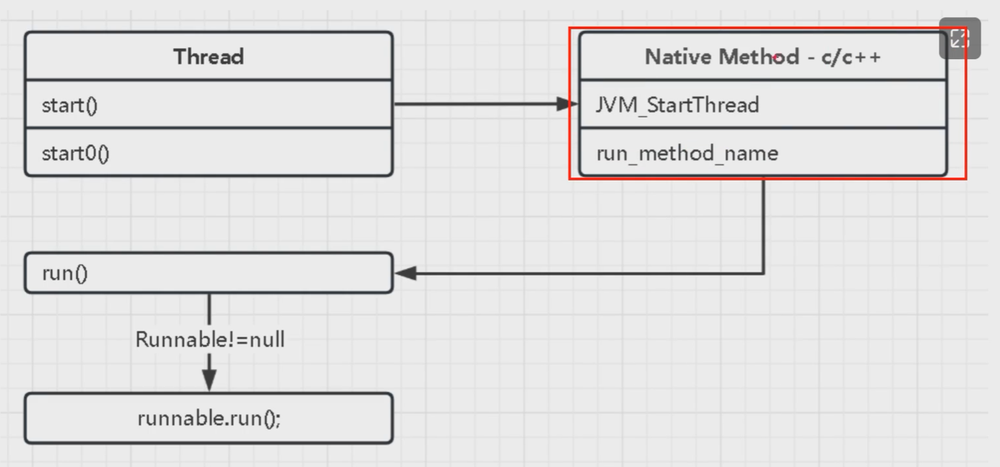

### start与run

##### 类型

run方法是同步方法，而start方法是异步方法。

##### 作用

run方法的作用是存放任务代码，而start的方法呢是启动线程

##### 线程数量方面

执行run方法它不会产生新线程，而执行start方法会产生新线程。

##### 调用次数

run方法可以被执行无数次，而start方法只能被执行一次，原因就在于线程不能被重复启动。

### 线程的休眠

使用线程的sleep()可以使线程休眠指定的毫秒数，在休眠结束的时候继续执行线程

##### 测试：

```java
public class TestSleep{
	public static void main(String[] args){
		new SleepThread().start();
	}
}
```

其它线程可以使用interrupt方法打断正在睡眠的线程，这时sleep方法 会抛出InterruptedException

建议用TimeUnit的sleep代替Thread的sleep来获得更好的可读性。其底层还是sleep方法。

在循环访问锁的过程中，可以加入sleep让线程阻塞时间，防止大量占用cpu资源。

### 线程的让步

Thread.yield()方法作用是：暂停当前正在执行的线程对象（及放弃当前拥有的cpu资源），并执行其他线程。

yield()做的是让当前运行的线程回到可运行状态，以允许具有相同优先级的其他线程获得运行机会。因此，使用yield()的目的是让相同优先级的线程之间能适当的轮转执行，但是，实际中无法保证yield()达到让步目的，因为让步的线程还有可能被线程调度程序再次选中。

**yield()方法并不能保证线程一定会让CPU资源，它只是一个提示，告诉调度器当前线程愿意让出CPU资源。具体是否让出CPU资源，还是由调度器决定。**

### 线程打断

public void interrupt()

##### 实例方法interrupt()仅仅是设置线程的中断状态为true，不会停止线程。

public boolean isInterrupted()

##### 通过检查中断标志位，判断当前线程是否被中断。

public static boolean interrupted()

##### 静态方法，判断线程是否被中断，并清除当前中断状态

##### 也即是说这个方法做了两件事：

##### 1、返回当前线程的中断状态

##### 2、将当前线程的中断状态设为false

### 线程合并


### isAlive


### 守护线程

##### 默认情况下我们创建的线程都是用户线程（普通线程），进程需要等待所有的线程执行完毕后，进程才会结束。

##### 守护线程.setDaemon(true):设置守护线程

##### 想要查看线程到底是用户线程还是守护线程，可盈通过Thread.isDeamon()方法来判断，如果返回的结果是true则为守护线程，反之则为用户线程。

##### 当所有的用户线程退出后，守护线程会立马结束。

#### 应用：

##### 垃圾回收线程属于守护线程

##### tomcat用来接受处理外部的请求的线程就是守护线程。

### 线程的5种状态


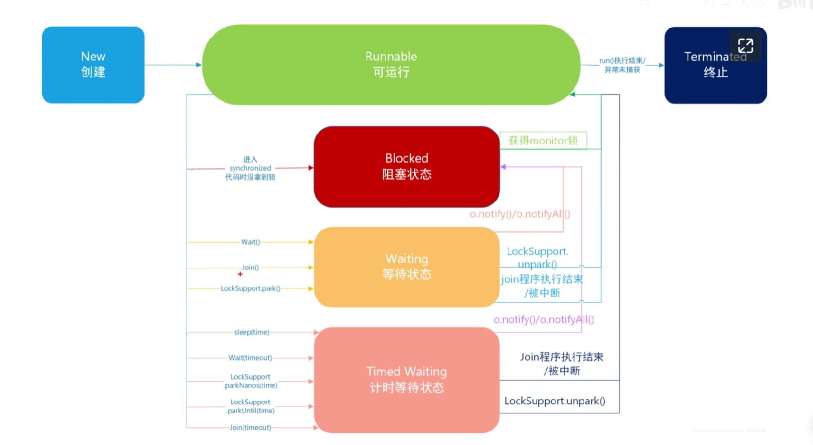

### 线程状态间转换

#### Blocked进入Runnable

##### 想要从Blocked状态进入Runable状态，我们上面说过必须要线程获得monitor锁，但是如果想进入其他状态就相对比较特殊，因为它是没有超时机制的，也就是不会主动进入。

#### Waiting进入Runnable

##### 只有当执行了LockSupport.unpark()，或者join的线程运行结束，或者被中断时可以进入Runnable状态。

#### Timed Waiting进入Runnable

##### 同样在Time Waiting中执行notify()和notifyAll()也是一样的道理，它们会先进入Blocked状态，然后抢夺锁成功后，再回到Runnable状态。

##### 但是对于Timed Waiting而言，它存在超时机制，也就是说如果超时时间到了那么就会系统自动直接拿到锁，或者当join的线程执行结束/调用了

##### LockSupport.unpark()/被中断等情况都会直接进入Runnable状态，而不会经历Blocked状态

#### 总结

##### 线程的状态是按照箭头方向来走的，比如线程从New状态是不可以直接进入Blocked状态的，他需要先经历Runnable状态。

##### 线程生命周期不可逆：一旦进入Runnable状态就不能回到New状态；一旦被终止就不能再有任何状态的变化。

##### 所以一个线程只能有一次New和Terminated状态，只有处于中间状态才可以相互转换。也就是这两个状态不会参与相互转化

### Callable接口

##### 一般情况下，使用Runnable接囗、Thread实现的线程我们都是无法返回结果的。但是如果对一些场合需要线程返回的结果。就要使用Callable、Future这几个类。Callable只能ExecutorService的线程池中跑，但有返回结果，也可以通过返回的Future对象查询执行状态。Future本身也是一种设计模式，它是用来取得异步任务的结果看看其源码：

```java
public interface Callable<V>{
	V call() throws Exception;
}
```

##### 它只有一个call方法，并且有一个返回V，是范型。可以认为这里返回V就是线程返回的结果。

```java
public class Main {
    public static void main(String[] args) {
        //第一步，创建Callable实现的实例，并实现call方法
        class Task implements Callable<Integer> {

            @Override
            public Integer call() throws Exception {
                return 5;
            }
        }
        Task task = new Task();//第2步，创建Callable实现类实例
        //第3步，使用FutureTask类来包装Callable对象，可以创建匿名对象
        //也可以直接用lambda省略1、2步
        FutureTask<Integer> future = new FutureTask<>(
                (Callable<Integer>) () -> {
                    return 5;
                }
        );
        //第4步，使用Future‘Task对象作为Thread对象的target创建、并启动新线程
        new Thread(future).start();
        try {
            Integer value = future.get();
        } catch (ExecutionException e) {
            throw new RuntimeException(e);
        } catch (InterruptedException e) {
            throw new RuntimeException(e);
        }
    }
}
```

### 线程的3种创建方式

##### JAVA中有三种线程创建方式：

##### （1）实现Runnable接口的run方法。

##### （2）继承Thread类并重写run的方法。

##### （3）使用FutureTask方式（实现Callable接口的方式）。

#### 三种方式的区别？

##### Java中，类仅支持单继承，如果一个类继承了Thread类，就无法再继承其它类，因此，如果一个类既要继承其它的类，又必须创建为一个线程，就可以使用Runnable接口的方式。

##### 使用实现Callable接口的方式创建的线程，可以获取到线程执行的返回值、是否执行完成等信息。

### 什么是线程池


##### 我们使用线程的时候就去创建一个线程，这样实现起来非常简便，但是就会有一个问题：

##### 如果并发的线程数量很多，并且每个线程都是执行一个时间很短的任务就结束了，这样频繁创建线程就会人人降低系统的效率，因为频繁创建线程和销毁线程需要时间。

##### 那么有没有一种办法使得线程可以复用，就是执行完一个任务，井不被销毁，而是可以继续执行其他的任务？

##### 在Java中可以通过线程池来达到这样的效果。

##### 线程池：其实就是一个容纳多个线程的容器，其中的线程可以反复使用，省去了频繁创建线程对象的操作，无需反复创建线程而消耗过多资源。

### 为什么用线程池

#### 线程池的优势：

##### 		线程池做的工作丰要是控制运行的线程数量，处理过程中将任务放入队列，然后在线程创建后启动这些任务，如果线程数量超过了最大数量，超出数量的线程排队等候，等其他线程执行完毕，再从队列中取出任务来执行。

##### 它的主要特点为：线程复用；控制最大并发数；管理线程。

##### 第一：*降低资源消耗。*通过重复利用已创建的线程降低线程创建和销毁造成的销耗。

##### 第二：*提高响应速度。*当任务到达时，任务可以不需要等待线程创建就能立即执行。

##### 第三：*提高线程的可管理性。*线程是稀缺资源，如果无限制的创建，不仅会销耗系统资源，还会降低系统的稳定性，使用线程池可以进行统一的分配，调优和监控

### 线程池的使用

##### Java里面线程池的顶级接口是java.util.concurrent.Executor，但是严格意义上讲Executor并不是一个线程池，而只是一个执行的工具。真正的线程池接口是java.util.concurrent.ExecutorService。要配置一个线程池是比较复杂的，尤其是对于线程池的原理不是很清楚的情况下，很有可能配置的线程池不是较优的，因此再java.util.concurrent.Executors线程工厂类里面提供了一些静态工厂，生成一些常用的线程池。官方建议使用Executors工厂类来创建线程池对象。

##### Java类库提供了许多静态方法创建一个线程池：

##### a、newFixedThreadPool创建一个固定长度的线程池，当到达线程最大数量时，线程池的规模将不再变化。

##### b、newCachedThreadPool创建一个可缓存的线程池，如果当前线程池的规模超出了处理需求，将回收空的线程；当需求增加时，会增加线程数量；线程池规模无限制。

##### c、newSingleThreadPoolExecutor创建一个单线程的Executor，确保任务对了，串行执行。

##### d、newScheduledThreadPool创建一个固定长度的线程池，而且以延续或者定时的方式来执行任务，类似于Timer。

### 线程池的关闭

```java
try{
	for(int i=1;i<=10;i++){
		threadPool.execute(task);

	}
}catch(Exception e){
	e.printStackTrace();
}finally{
	// 关闭线程池，问题：线程池中一直占用系统资源，内存泄漏，主线程不会退出
	// 不会立马停止正在执行的线程，会等待所有的任务执行完成之后才彻底关闭
	// threadPool.shutdown();
    // 不会立马停止正在执行的线程，只会等待正在执行的线程执行完成之后才彻底关闭
    threadPool.shutdownNow();
    try{
        //等待线程池关闭，等待线程池中所有的线程执行完。
        threadPool.awaitTermination(Long.Max_Value,TimeUnit.SECONDS);
    }catch(InterruptedException e){
        e.printStackTrace();
    }

	// 判断线程池是否真正的“终止”了，并且代表线程池也已经执行完毕
	System.out.println(threadPool.isTerminated());
}
```


### execute方法和submit方法区别

```java
// execute方法和submit有什么区别
// 1.参数
// execute Runnable.run
// submit Callable
// 2.返回值
// execute void
// submit Future
// 3.异常
// execute 会在子线程中抛出异常，在主线程捕捉不到
// submit 不会立马抛出异常，而是会将异常暂存起来，等Future.get()方法的时候，才会抛出，并且能在主线程捕捉到

// 为什么execute也可以执行带返回值的线程
FutureTask<Integer> future = new FutureTask<Integer>(()->{
   System.out.println("执行");
   return 5;
});
threadPool.execute(future);
Integer integer = future.get();
System.out.println(integer);
/*Future<Interger> future = threadPool.submit(()->{
	System.out.println("执行...")；
	return 5;
});
Integer integer = future.get();
System.out.println(integer);*/
```

### 线程池参数&原理

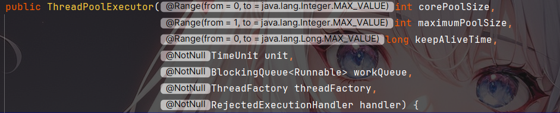

##### corePoolSize：核心线程池数量

##### maximumPoolSize：最大线程数量

##### keepAliveTime：非核心线程的空闲状态的存活时间（数字1）

##### unit：时间单位（天、小时、...）

​	`NANOSECONDS`：纳秒（十亿分之一秒）

​	`MICROSECONDS`：微秒（百万分之一秒）

​	`MILLISECONDS`：毫秒（千分之一秒）

​	`SECONDS`：秒

​	`MINUTES`：分钟

​	`HOURS`：小时

​	`DAYS`：天

##### workQueue：工作队列（阻塞队列）

​	`ArrayBlockingQueue`：一个由数组支持的固定大小的`BlockingQueue`

​	`LinkedBlockingQueue`：一个由链接节点组成的无界`BlockingQueue`

​	`PriorityBlockingQueue`：一个具有优先级排序的无界`BlockingQueue`

##### threadFactory：线程工厂（创建线程）

##### handler：拒绝策略，有以下4种取值：

​	`ThreadPoolExecutor.AbortPolicy`丢弃任务并抛出`RejectedException`异常。

​	`ThreadPoolExecutor.DiscardPolicy`：也是丢弃任务，但是不抛出异常。

​	`ThreadPoolExecutor.DiscardOldestPolicy`:丢弃队列最前面的任务，然后重新尝试执行任务（重复此过程）

​	`ThreadPoolExecutor.CallerRunsPolicy`：由调用线程处理该任务

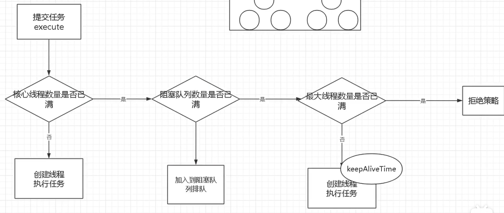

### 自定义线程池

```java
public class C2_CustomeThreadPool {
    public static void main(String[] args) {
        ExecutorService threadPool = new ThreadPoolExecutor(
                10,//核心线程数
                20,//最大线程数
                0L,//非核心线程的空闲状态的存活时间
                TimeUnit.SECONDS,
                new ArrayBlockingQueue<Runnable>(10),//阻塞队列
                Executors.defaultThreadFactory(),//默认线程工厂
                new ThreadPoolExecutor.AbortPolicy()//默认拒绝策略
        );

        //10个顾客请求
        class MyTask implements Runnable {
            int i = 0;

            public MyTask(int i) {
                this.i = i;
            }

            @Override
            public void run() {
                System.out.println(Thread.currentThread().getName() + "程序员做第" + i + "个项目");
                try {
                    Thread.sleep(3000L);//业务逻辑
                } catch (Exception e) {
                    e.printStackTrace();
                }
            }
        }
        try{
            for (int i = 1; i <= 100; i++) {
                MyTask task = new MyTask(i);
                threadPool.execute(task);
            }
        }catch(Exception e){
            e.printStackTrace();
        }finally{
            threadPool.shutdown();
        }
    }
}
```

**创建优先：核心1-10-->阻塞11-20-->最大21-30**

**执行优先：核心1-10-->最大21-30-->阻塞11-20**

### tomcat线程池和jdk线程池区别？

```java
public int prestartAllCoreThreads(){//tomcat线程池构造函数调用此方法而jdk没有
	int n=0;
	while(addWorker(null,true)){
		++n;
	}
	return n;
}
```

### 线程池如何创建线程？

```java
ArrayBlockingQueue<Runnable> blockingQueue = new ArrayBlockingQueue<>(10);//伪
new Thread(new Runnable(){
	@Override
	public void run(){
		Runnable task;
		while((task = blockingQueue.poll()) != null){//当阻塞队列为空（保活）反之拿到任务运行
			task.run();
		}
	}
}).start();
```

### 线程池拒绝策略

```java
public static class AbortPolicy implements RejectedExecutionHandler {
        /**
         * Creates an {@code AbortPolicy}.
         */
        public AbortPolicy() { }

        /**
         * Always throws RejectedExecutionException.
         *
         * @param r the runnable task requested to be executed
         * @param e the executor attempting to execute this task
         * @throws RejectedExecutionException always
         */
        public void rejectedExecution(Runnable r, ThreadPoolExecutor e) {
            throw new RejectedExecutionException("Task " + r.toString() +
                                                 " rejected from " +
                                                 e.toString());
        }
    }
//使用 AbortPolicy 的线程池拒绝执行任务时，它会立即抛出一个异常，这可以由调用代码捕获并处理。
```

```java
public static class DiscardPolicy implements RejectedExecutionHandler {
        /**
         * Creates a {@code DiscardPolicy}.
         */
        public DiscardPolicy() { }

        /**
         * Does nothing, which has the effect of discarding task r.
         *
         * @param r the runnable task requested to be executed
         * @param e the executor attempting to execute this task
         */
        public void rejectedExecution(Runnable r, ThreadPoolExecutor e) {
        }
    }
//使用 DiscardPolicy 的线程池拒绝执行任务时，它会默默地丢弃这个任务，并且不产生任何异常或通知。
```

```java
public static class DiscardOldestPolicy implements RejectedExecutionHandler {
        /**
         * Creates a {@code DiscardOldestPolicy} for the given executor.
         */
        public DiscardOldestPolicy() { }

        /**
         * Obtains and ignores the next task that the executor
         * would otherwise execute, if one is immediately available,
         * and then retries execution of task r, unless the executor
         * is shut down, in which case task r is instead discarded.
         *
         * @param r the runnable task requested to be executed
         * @param e the executor attempting to execute this task
         */
        public void rejectedExecution(Runnable r, ThreadPoolExecutor e) {
            if (!e.isShutdown()) {
                e.getQueue().poll();
                e.execute(r);
            }
        }
    }
//使用 DiscardOldestPolicy 的线程池拒绝执行任务时，它会移除队列中最老的任务，并重新尝试执行被拒绝的任务。这种方法的优点是可以避免无限期地等待队列中的任务被执行，缺点是在某些情况下可能会丢失一些重要数据。
```

```java
public static class CallerRunsPolicy implements RejectedExecutionHandler {
        /**
         * Creates a {@code CallerRunsPolicy}.
         */
        public CallerRunsPolicy() { }

        /**
         * Executes task r in the caller's thread, unless the executor
         * has been shut down, in which case the task is discarded.
         *
         * @param r the runnable task requested to be executed
         * @param e the executor attempting to execute this task
         */
        public void rejectedExecution(Runnable r, ThreadPoolExecutor e) {
            if (!e.isShutdown()) {
                r.run();
            }
        }
    }
//使用 CallerRunsPolicy 的线程池拒绝执行任务时，它会在调用方的线程中执行该任务。这种方法的优点是可以避免长时间等待队列中的任务被执行，并且不会增加系统资源的消耗；缺点是可能会导致主线程阻塞，影响系统的响应速度。
```

### 线程池淘汰策略

```java
final void runWorker(Worker w) {
    Thread wt = Thread.currentThread(); // 获取当前线程
    Runnable task = w.firstTask; // 获取worker的第一个任务
    w.firstTask = null; // 清空worker的第一个任务
    w.unlock(); // 解锁worker，允许中断

    boolean completedAbruptly = true; // 标记是否突然完成（比如被中断）
    try {
        while (task != null || (task = getTask()) != null) { // 当任务不为空时循环执行
            w.lock(); // 上锁worker

            // 如果线程池正在停止或线程被中断并且线程池至少处于STOP状态，则中断线程
            if ((runStateAtLeast(ctl.get(), STOP) ||
                 (Thread.interrupted() &&
                  runStateAtLeast(ctl.get(), STOP))) &&
                !wt.isInterrupted())
                wt.interrupt();

            try {
                beforeExecute(wt, task); // 在执行任务前调用beforeExecute方法
                try {
                    task.run(); // 执行任务
                    afterExecute(task, null); // 在任务正常完成后调用afterExecute方法
                } catch (Throwable ex) {
                    afterExecute(task, ex); // 在任务异常完成后调用afterExecute方法
                    throw ex; // 抛出异常
                }
            } finally {
                task = null; // 清空任务
                w.completedTasks++; // 已完成的任务数加1
                w.unlock(); // 解锁worker
            }
        }
        completedAbruptly = false; // 标记为正常完成
    } finally {
        processWorkerExit(w, completedAbruptly); // 处理worker退出
    }
}
```

这是一个 `ThreadPoolExecutor` 的核心方法之一，它用于执行 worker 线程中的任务。这个方法主要分为以下几个部分：

  * 初始化变量和获取第一个任务。
  * 使用一个循环来执行任务，直到没有任务为止。
  * 检查线程池的状态，并在必要时中断线程。
  * 在执行任务之前、之后调用回调方法。
  * 处理任务的异常情况。
  * 更新已完成任务的数量。
  * 最后处理 worker 线程的退出。

```java
private Runnable getTask() {
    boolean timedOut = false; // Did the last poll() time out?

    for (;;) { // 循环直到获取到任务或者线程池被关闭
        int c = ctl.get(); // 获取ctl的值

        // Check if queue empty only if necessary.
        if (runStateAtLeast(c, SHUTDOWN) // 如果线程池状态至少为SHUTDOWN
            && (runStateAtLeast(c, STOP) || workQueue.isEmpty())) { // 并且工作队列为空 或者 线程池状态至少为STOP
            decrementWorkerCount(); // 减少worker数量
            return null; // 返回null表示没有任务可执行
        }

        int wc = workerCountOf(c); // 获取当前工作的worker数量

        // Are workers subject to culling?
        boolean timed = allowCoreThreadTimeOut || wc > corePoolSize;

        if ((wc > maximumPoolSize || (timed && timedOut))
            && (wc > 1 || workQueue.isEmpty())) { // 当前工作的worker数量大于最大pool size 或允许核心线程超时并且上一次poll()超时，并且当前工作的worker数量大于1或工作队列为空
            if (compareAndDecrementWorkerCount(c)) // 减少worker数量
                return null; // 返回null表示没有任务可执行
            continue; // 继续循环
        }

        try {
            Runnable r = timed ?
                workQueue.poll(keepAliveTime, TimeUnit.NANOSECONDS) : // 超时时间等待获取任务
                workQueue.take(); // 阻塞式获取任务
            if (r != null)
                return r; // 返回获取到的任务
            timedOut = true; // 标记为超时
        } catch (InterruptedException retry) {
            timedOut = false; // 标记未超时
        }
    }
}
```

这个方法用于从工作队列中获取一个任务，如果工作队列为空，则会阻塞等待。当线程池处于SHUTDOWN或STOP状态时，如果没有待处理的任务，它将减少正在运行的工作者的数量并返回null。

```java
private void processWorkerExit(Worker w, boolean completedAbruptly) {
    // 如果是突然退出，那么workerCount没有进行调整，需要减一
    if (completedAbruptly)
        decrementWorkerCount();

    final ReentrantLock mainLock = this.mainLock;
    // 获取锁
    mainLock.lock();
    try {
        // 更新已完成任务数
        completedTaskCount += w.completedTasks;
        // 移除该工作线程
        workers.remove(w);
    } finally {
        // 释放锁
        mainLock.unlock();
    }

    // 尝试终止
    tryTerminate();

    int c = ctl.get();
    // 当运行状态小于STOP时，进行以下操作
    if (runStateLessThan(c, STOP)) {
        // 如果不是突然退出
        if (!completedAbruptly) {
            // 允许核心线程超时的情况下，最小值为0，否则为corePoolSize
            int min = allowCoreThreadTimeOut ? 0 : corePoolSize;
            // 如果最小值为0且工作队列不为空，设置最小值为1
            if (min == 0 && ! workQueue.isEmpty())
                min = 1;
            // 如果当前工作线程数量大于等于最小值，说明不需要替换新的工作线程
            if (workerCountOf(c) >= min)
                return; // replacement not needed
        }
        // 添加一个新的工作线程，并设置为非守护线程
        addWorker(null, false);
    }
}
```

以上代码主要是处理工作线程退出的过程，包括更新已完成任务数、移除工作线程、尝试终止线程池以及判断是否需要添加新的工作线程。

### 线程池五种状态


```java
	private final AtomicInteger ctl = new AtomicInteger(ctlOf(RUNNING, 0));
	private static final int COUNT_BITS = Integer.SIZE - 3;
    private static final int COUNT_MASK = (1 << COUNT_BITS) - 1;

	// runState is stored in the high-order bits
    private static final int RUNNING    = -1 << COUNT_BITS;
    private static final int SHUTDOWN   =  0 << COUNT_BITS;
    private static final int STOP       =  1 << COUNT_BITS;
    private static final int TIDYING    =  2 << COUNT_BITS;
    private static final int TERMINATED =  3 << COUNT_BITS;
```

1、RUNNING

(1) 状态说明：线程池处在RUNNING状态时，能够接收新任务，以及对已添加的任务进行处理。
(2) 状态切换：线程池的初始化状态是RUNNING。换句话说，线程池被一旦被创建，就处于RUNNING状态，并且线程池中的任务数为0！

```java
private final AtomicInteger ctl = new AtomicInteger(ctlOf(RUNNING, 0));
```

2、 SHUTDOWN

(1) 状态说明：线程池处在SHUTDOWN状态时，不接收新任务，但能处理已添加的任务。
(2) 状态切换：调用线程池的shutdown()接口时，线程池由RUNNING -> SHUTDOWN。

3、STOP

(1) 状态说明：线程池处在STOP状态时，不接收新任务，不处理已添加的任务，并且会中断正在处理的任务。
(2) 状态切换：调用线程池的shutdownNow()接口时，线程池由(RUNNING or SHUTDOWN ) -> STOP。

4、TIDYING

(1) 状态说明：当所有的任务已终止，ctl记录的”任务数量”为0，线程池会变为TIDYING状态。当线程池变为TIDYING状态时，会执行钩子函数terminated()。terminated()在ThreadPoolExecutor类中是空的，若用户想在线程池变为TIDYING时，进行相应的处理；可以通过重载terminated()函数来实现。
(2) 状态切换：当线程池在SHUTDOWN状态下，阻塞队列为空并且线程池中执行的任务也为空时，就会由 SHUTDOWN -> TIDYING。
当线程池在STOP状态下，线程池中执行的任务为空时，就会由STOP -> TIDYING。

5、 TERMINATED

(1) 状态说明：线程池彻底终止，就变成TERMINATED状态。
(2) 状态切换：线程池处在TIDYING状态时，执行完terminated()之后，就会由 TIDYING -> TERMINATED。

### 线程安全

#### 什么是线程安全

大白话：

多线程下并发同时对共享数据进行读写，会造成数据混乱 = 线程不安全

当多线程并发访问临界资源时，如果破坏其原子性、可见性、有序性，可能会造成数据不一致。

- 临界资源：共享资源（同一对象）同时读写，一次仅允许一个线程使用，才保证其正确性。
- 原子性：提供互斥访问，同一时刻只能有一个线程对数据进行操作（Atomic、CAS算法、synchronized、Lock）
- 可见性：确保共享变量的修改对于其他线程是可见的（volatile关键字、synchronized、Lock）
- 有序性：保证代码执行的顺序与程序的顺序一致，避免指令重排序导致数据不一致（happens-before原则、volatile、synchronized、Lock）

#### 一、原子性

**原子性的操作是不可被中断的一个或一系列操作。**

个人理解，严格的原子性的操作，其他线程获取操作的变量时，**只能获取操作前的变量值和操作后的变量值**，不能获取到操作过程中的中间值，在操作过程中其他操作需要获取变量值，需要进入**阻塞状态**等待操作结束。

如果不能保证原子性会有什么问题呢

让我们一块看一个简单例子吧

首先写一个简单的线程，代码如下

```java
public class ThreadDemo implements Runnable{
	 int no = 0;
	 @Override
	 public void run() {
		 no++;
		 System.out.println(no);
	 }
	 public static void main(String[] args)
	 {
		 ThreadDemo demo = new ThreadDemo();
		 for(int i=0;i<1000;i++)
		 {
			 Thread task = new Thread(demo);
			 task.start();
		 }
	 }
}
```

Main函数中启动了1000个线程，每个线程都对no进行了一次+1操作，理想情况下no最后的结果应该是1000，可是我的运行最终结果只有996，执行了1000次+1操作，最后的结果为什么不是1000呢，这就要说到no++操作不是原子的问题了（no可见性的问题在下一个小结讨论）

先对no++这个操作分解，可以分为三步：取值，加一，赋值，这三个操作都是原子的，不过合在一起就不行了。两个线程A、B一起来操作no，no初始值是1,线程A读取no值是1，然后做no+1，这时线程B对 no取值还是1，然后A将2赋值给no，B操作no+1结果是2，也将2赋值给no。对1做了两次+1操作，最后结果是2。这个过程可以参考下图


所以，需要保证这种不可分割操作的原子性，那要怎么做才能保证原子性呢，有两种方式

**1、加锁synchronized，保证同一时间只有一个线程操作变量，其他线程需等待操作结束才能使用临界资源**

**2、使用CAS操作，变量计算前保留一份旧值a，计算完成后结果值为b，把b刷到内存之前先比较a是否和内存中变量一致，如果一致，就把内存中的变量赋值为b，不一样，重新获取内存中变量值，重复一遍操作，一直到a和内存中一致，操作结束。**

**Lock和原子类（AtomicInteger等）是通过使用unsafe的compareAndSwap方法实现CAS操作保证原子性的。**

#### 二、可见性

线程变量的可见性问题，需要从操作系统的CPU、缓存、内存的矛盾开始说起。读写性能上 **CPU>缓存>内存>I/O**。CPU/缓存/内存的结构看下图。


CPU和内存之间隔着缓存和CPU寄存器。缓存还分为一级、二级、三级缓存。CPU的读写性能上要大于内存，为了提高效率会将数据先取到缓存中，**CPU处理完数据后会先放到缓存中，然后同步到内存中。**

如果不理解CPU缓存这部分内容的话，可以简单的认为每个线程都有自己的本地工作内存，变量会先缓存到**本地工作内存**中使用，修改后会先修改工作内存中的存储，然后在同步到主内存中。结构如下图


这种内存结构会引起什么问题呢，现在有一个变量var，线程A对var做了一次修改，刚放到缓存（工作内存）还未同步到内存时，另外一个线程B也来使用var，读取到的还是var未修改值。

共享的变量需要保证可见性，怎么保证共享变量的可见性呢

**1、加锁（加锁是万能的操作）synchronized和Lock都可以保证。**

**线程在加锁时，会清空工作内存中共享变量的值，共享变量使用是需要从主内存中重新获取。**

**线程解锁是，会把共享变量重新刷新到主内存中。**

**2、使用volatile修饰共享变量，volatile修饰的共享变量在修改后会立即被更新到内存中，其他线程使用共享变量会去内存中读取**

优先使用volatile来解决可见性问题，加锁需要消耗的资源太多。

#### 三、有序性

为了优化程序性能，编译器、处理器和运行时会对代码指令进行重排，重排过程中会遵循as-if-serial语义，即不影响单线程的运行结果。

**扩展一下 指令重排为什么会提高程序性能呢，我个人理解是CPU是多核处理的，为了保证处理器资源的充分利用，对代码指令进行乱序处理，即可以多个处理器并行处理指令，防止不相关的指令需要等待上一个指令结束才能开始。**

代码执行顺序被重排会是什么效果呢，举个简单例子

```java
 int a =0;
 a=2;
 int b =1;
 int c= a+b;
```

这段代码中变量a和b 是相互不影响的，优化后可以是如下代码，只要保证执行结果不变，有依赖的变量c在变量a和b之后处理即可

```java
 int b =1;
 int a =0;
 a=2;
 int c= a+b;
```

在单线程中这样是没有问题的，如果是多线程呢，看下如下代码

```java
public class Task {
	 static Object val =null;
	 static boolean finish =false;
	 public static void main(String[] args)
	 {
		 Runnable task1 = new Runnable() {
			 @Override
			 public void run() {
				 if(finish)
				 {
					 System.out.println(val.toString());
				 }
			 }
		 };
		 Runnable task2 = new Runnable() {
			 @Override
			 public void run() {
				 val = new Object();
				 finish =true;
			 }
		 };
	 }
}
```

分别创建两个任务task1和task2,他们共享两个变量val和finish，按现在的顺序执行的话，task1不会出现val为null时被使用的情况。不过进行了指令重排之后呢，task2中val和finish操作顺序调整对单线程来说是没有任何影响的，所以task2的代码可能会变成

```java
@Override
 public void run() {
     finish =true;
     val = new Object();
 }
```

这样task1中，就会出现finish为true，val为null的情况了。

那么怎么保证多个线程中的代码顺序一致性呢

**1、加锁（还是加锁）synchronized和Lock，保证同一时刻只有一个线程进行操作**

**2、使用volatile修饰变量，在JMM中volatile的读和写都会插入内存屏障来禁止处理器的重排**

这样原子性、可见性、有序性就基本讲完了，其中有很多的知识点没有详细的说，例如：

CAS、volatile、synchronized、lock等等，这些会在后边的文章中慢慢研究。


注：**如果弄不清楚原子性和可见性的区别，只要记住下边两点内容**

**1、原子性针对完整的操作过程，其他操作只能获取操作前或操作后的变量数据**

**2、可见性主要是变量修改，变量修改后，马上刷新到内存中，而其他线程能感知到变量的修改**

### 如何解决线程不安全

#### 破坏临界资源

##### 只读

`final`

##### 局部变量

每个线程的局部变量会存在栈中，会在每个线程内存中被创建多份，因此不存在共享。

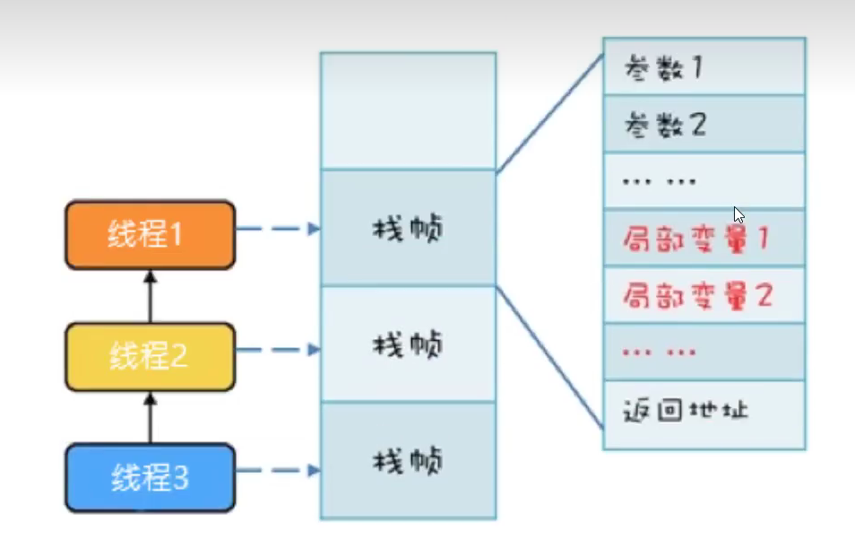

### ThreadLocal

#### ThreadLocal是什么？

ThreadLocal也就是线程本地变量。如果你创建了一个ThreadLocal变量，那么访问这个变量的每个线程都会有这个变量的一个本地拷贝，多个线程操作这个变量的时候，实际是操作自己本地内存里面的变量，从而起到线程隔离的作用，避免了线程安全的问题。

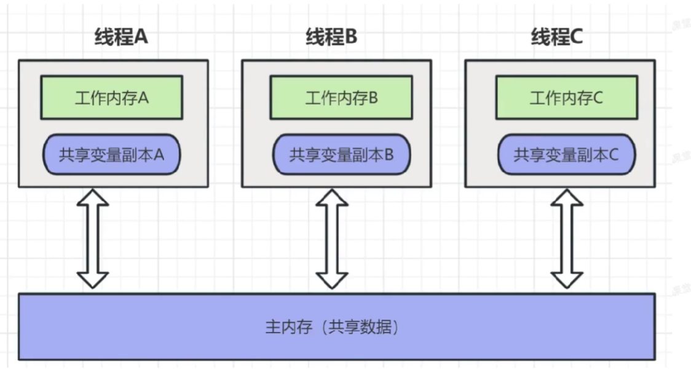

ThreadLocal是整个线程的全局变量，不是整个程序的就全局变量。

```java
public class C2_CustomeThreadPool {
    static ThreadLocal<User> userThreadLocal = new ThreadLocal<>();

    public static void main(String[] args) {
        //线程1
        Thread thread1 = new Thread(() -> {
            userThreadLocal.set(new User());
            User user = userThreadLocal.get();
            for (int i = 0; i < 1000000; i++) {
                user.age++;
            }
        });
        thread1.start();

        //线程2
        Thread thread2 = new Thread(() -> {
            userThreadLocal.set(new User());
            User user = userThreadLocal.get();
            for (int i = 0; i < 1000000; i++) {
                user.age++;
            }
        });
        thread2.start();
    }
}
```

- ThreadLocal是Java中所提供的线程本地存储机制，可以利用该机制将数据缓存在某个线程内部，该线程可以在任意时刻，任意方法中获取缓存的数据
- ThreadLocal底层是通过ThreadLocalMap来实现的，每个Thread对象（注意不是ThreadLocal对象）中都存在一个ThreadLocalMap，Map的key为ThreadLocal对象，Map的value为需要缓存的值

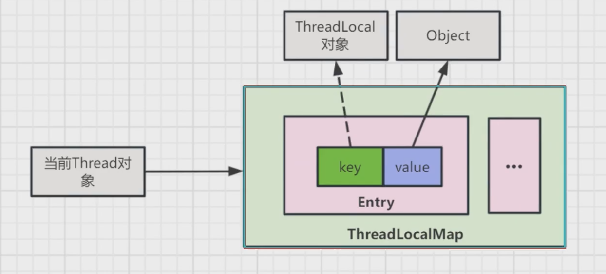

实现方式观察ThreadLocal的set方法：

```java
public void set(T value){
    Thread t= Thread.currentThread();
    ThreadLocalMap map = getMap(t);
    if(map!=null)
        map.set(this,value);
    else
        createMap(t,value);
}

ThreadLocalMap getMap(Thread t){
    return t.threadLocals;
}

ThreadLocal.ThreadLocalMap threadLocals = null;

static class Entry extend WeakRefenrence<ThreadLocal<?>>{
    Object value;

    Entry(ThreadLocal<?> k, Object v){
        super(k);
        value = v;
    }
}
```

### ThreadLocal内存泄漏是怎么回事？

如果在线程池中使用ThreadLocal会造成内存泄漏，因为当ThreadLocal对象使用完成之后，应该要把设置的key，value，也就是Entry对象进行回收，但线程池中的线程不会回收，而线程对象是通过强引用指向ThreadLocalMap，ThreadLocalMap也是通过强引用指向Entry对象，线程不被回收，Entry对象也就被回收，从而出现内存泄漏。

解决办法是在使用ThreadLocal对象之后，手动调用ThreadLocal的remove方法，手动清除Entry对象。

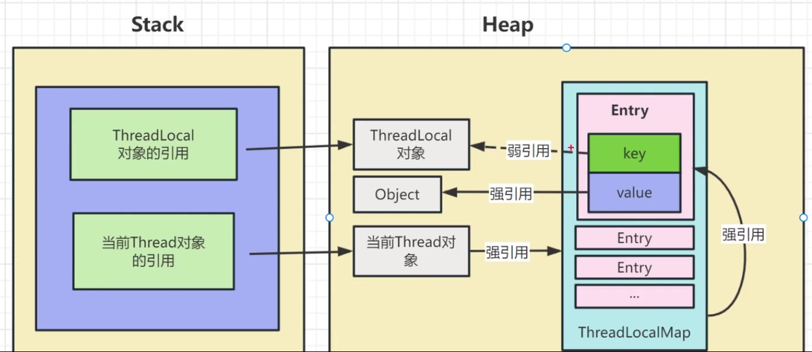

```java
public class BaiLiThreadLocalMemoryLeakDemo{
	private staticprivate static final  ThreadLocal<byte[]> threadLocal = new ThreadLocal<>();

    public static void main(String[] args) throws InterruptedException {
        ExecutorService executorService = Executors.newFixedThreadPool(5);
        for (int i = 0; i <100 ; i++) {
            executorService.execute(()->{
                byte[] data = new byte[1024*1024];
                threadLocal.set(data);
                //不调用remove方法，会导致内存泄漏
                //threadLocal.remove();
            });
        }
        executorService.shutdown();
        executorService.awaitTermination(1, TimeUnit.MINUTES);
    }
}
```

### InheritableThreadLocal是什么？

InheritableThreadLocal是ThreadLocal子类，继承关系如下

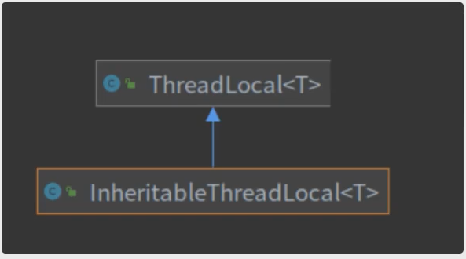

在拥有了ThreadLocal的情况下，为什么还要InheritableThreadLocal？它在那些场景中可以用。

我们看一下下面的代码

```java
public class Demo{
    public static void main(String[] args) throws InterruptedException {
        ThreadLocal<String> threadLocal = new ThreadLocal<>();
        threadLocal.set("test");
        Thread thread = new Thread(new Runnable() {
            @Override
            public void run() {
                String value = threadLocal.get();
                System.out.println("value" + value);
            }
        });
        thread.start();
        Thread.sleep(10000);
    }
}
```

```java
public class Demo{
    public static void main(String[] args) throws InterruptedException {
        InheritableThreadLocal<String> threadLocal = new InheritableThreadLocal<>();
        threadLocal.set("test");
        Thread thread = new Thread(new Runnable() {
            @Override
            public void run() {
                String value = threadLocal.get();
                System.out.println("value" + value);
            }
        });
        thread.start();
        Thread.sleep(10000);
    }
}
```

**我们可以发现当我们改变了InheritableThreadLocal中的值后，输出的值都是一样的。这是因为，使用线程池时，核心线程在首次使用被创建的时候正确复制父线程的上下文，但之后已复制上下文的核心线程不会回收的情况下，线程池中的线程上下文将不会再被改变！这是我们尤其要注意使用InheritableThreadLocal的点，如果我们过于信任它的传递能力，无疑在碰到线程时要踩坑！反而不如使用ThreadLocal时刻提醒自己它要手动传递、初始化、清理线程上下文**

**在这种情况下我们可以使用，阿里开源的TransmittableThreadLocal，可以避免InheritableThreadLocal在多线程中出现不一致的情况。**

### volatile

volatile关键字具备两个特性，一是可见性，一是禁止指令重排。

```java
public class C1_VisibilityTest{
	static volatile Boolean always = true;
	public static void main(String[] args) throw InherruptedException {
		//线程1
		new Thread(() -> {
			while(always){
				//System.out.println("执行...");
				//synchronized(always){
				//
				//}
			}
		}).start();

		Thread.sleep(2000);
		//线程2

        always = false;
	}
}
```

### JMM内存模型怎么回事

#### JMM内存模型

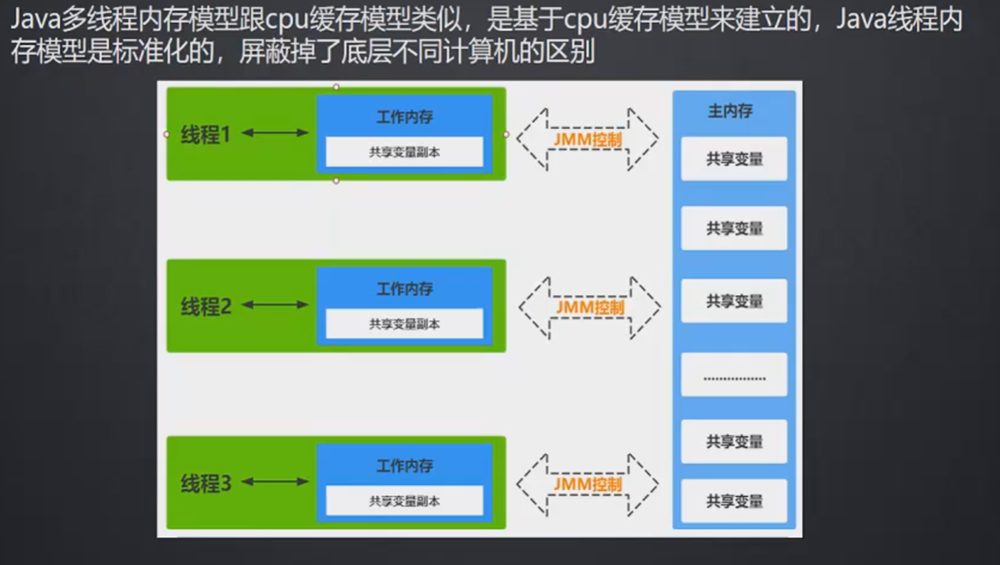

```java
public class VolatileVisibiltityTest{
    private static boolean initFlag = false;
    //private static volatile boolean initFlag = false;
    public static void main(String[] args) throws InterruptedException{
        new Thread(() -> {
            System.out.println("waiting data...");
            while(!initFlag){

            }
            System.out.println("=============success");
        }).start();
        Thread.sleep(2000);
        new Thread(() -> prepareData()).start());
    }
    public static void prepareData(){
        System.out.println("prepare data...");
        initFlag = true;
        System.out.println("prepare data end...");
    }
}
```

### JMM数据原子操作

- **read（读取）：**从主内存读取数据
- **load（载入）：**将内存读取到数据写入到工作内存
- **use（使用）：**从工作内存读取数据来计算
- **assign（赋值）：**将计算好的值重新赋值到工作内存中
- **store（存储）：**将工作内存数据写入主内存中
- **write（写入）：**将store过去的变量赋值给主内存中的变量
- **lock（锁定）：**将主内存变量加锁，标识为线程独占状态
- **unlock（解锁）：**将主内存变量解锁，解锁后其他线程可以锁定该变量

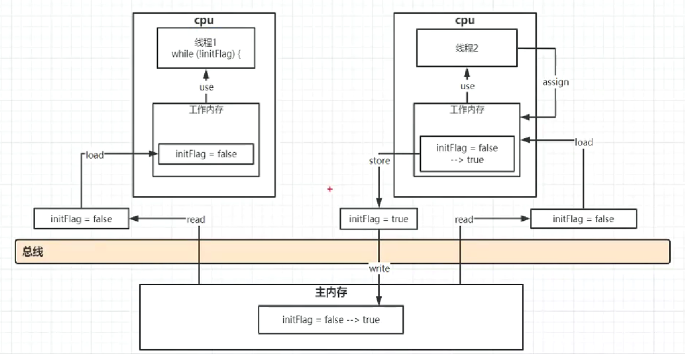

### JMM缓存不一致问题

- **缓存一致性协议（MESI）**

  多个cpu从主内存读取到同一个数据到各自的高速缓存，当其中某个cpu修改了缓存里的数据，该数据会马上同步会主内存，其它cpu通过总线嗅探器机制可以感知到数据的变化从而将自己缓存里的数据失效

- **缓存加锁**

  缓存锁的核心机制时基于缓存一致性协议来实现的，一个处理器的缓存回写到内存会导致其他处理器的缓存无效，IA-32和Intel 64处理器使用MESI实现缓存一致性协议

### Volatile可见性底层实现原理

- **Volatile缓存可见性实现原理**

  底层实现主要通过汇编lock前缀指令，它会锁定这块内存区域的缓存（**缓存行锁定**）并回写到主内存

  IA-32和Intel 64架构软件开发者手册对lock指令的解释：

  1）会将当前处理器缓存行的数据**立即**写回到系统内存。

  2）这个写回内存的操作会引起在其他CPU里缓存了该内存地址的数据无效（MESI协议）

  3）提供内存屏障功能，使lock前后指令不能重排序

- **Java程序汇编代码查看**

  -server -Xcomp -XX:+UnlockDiagnosticVMOptions -XX:+PrintAssembly -XX:CompileCommand=compileonly,*VolatileVisibilityTest.prepareData

### 指令重排与内存屏障

- 并发编程三大特性：**可见性 有序性 原子性**

- volatile保证可见性与有序性，但是不保证原子性，保证原子性需要借助synchronized这样的锁机制

- **指令重排序**：在不影响**单线程**程序执行结果的前提下，计算机为了最大限度的发挥机器性能，会对机器指令重排优化


- 重排序会遵循**as-if-serial**与**happens-before**原则
- **阿里面试题：**双重检测锁DCL对象半初始化问题
- 不同CPU硬件对于JVM的内存屏障规范实现指令不一样
- Intel CPU硬件级内存屏障实现指令
  - Ifence：是一种Load Barrier读屏障，实现LoadLoad屏障
  - sfence：是一种Store Barrier写屏障，实现StoreStore屏障
  - mfence：是一种全能型的屏障，具备Ifence和sfence的能力，具备所有屏障能力
- JVM底层简化了内存屏障硬件指令的实现
  - lock前缀：lock指令不是一种内存屏障，但是它能完成类似内存屏障的功能

### 单例模式DCL导致的可见性问题

通过双重检查锁（double-checked locking），实现延迟初始化需要将目标属性声明为volatile型，（比如修改helper的属性声明为private volatile Helper helper = null;）。

正例：

```java
public class LazyInitDemo{
	private volatile Helper helper = null;
	public Helper getHelper(){
		if(helper == null){
			synchronize(this){
				if(helper == null){
					helper = new Helper();
				}
			}
		}
		return helper;
	}
	//other methods and fields...
}
```

### 内存屏障

- #### Java规范定义的内存屏障

  |  屏障类型  |         指令示例          |                             说明                             |
  | :--------: | :-----------------------: | :----------------------------------------------------------: |
  |  LoadLoad  |  Load1；LoadLoad；Load2   |       保证load1的读取操作在load2及后续读取操作之前执行       |
  | StoreStore | Store1；StoreSore；Store2 | 在store2及其后的写操作执行前，保证store1的写操作已刷新到主内存 |
  | LoadStore  | Load1；LoadStore；Store2  |  在store2及其后的写操作执行前，保证load1的读操作已读取结束   |
  | StoreLoad  | Store1；StoreLoad；Load2  | 保证store1的写操作已刷新到主内存之后，load2及其后的操作才能执行 |


- #### Java规定volatile需要实现的内存屏障

|                                     |
| :---------------------------------- |
| **StoreStore屏障**                  |
| a=1; // volatile写，a为volatile变量 |
| **StoreLoad屏障**                   |
| b = a; //volatile读                 |
|**LoadLoad屏障**|
|**LoadStore屏障**|

```c++
if (cache->is_volatile()) {
            if (tos_type == itos) {
              obj->release_int_field_put(field_offset, STACK_INT(-1));
            } else if (tos_type == atos) {
              VERIFY_OOP(STACK_OBJECT(-1));
              obj->release_obj_field_put(field_offset, STACK_OBJECT(-1));
              OrderAccess::release_store(&BYTE_MAP_BASE[(uintptr_t)obj >> CardTableModRefBS::card_shift], 0);
            } else if (tos_type == btos) {
              obj->release_byte_field_put(field_offset, STACK_INT(-1));
            } else if (tos_type == ltos) {
              obj->release_long_field_put(field_offset, STACK_LONG(-1));
            } else if (tos_type == ctos) {
              obj->release_char_field_put(field_offset, STACK_INT(-1));
            } else if (tos_type == stos) {
              obj->release_short_field_put(field_offset, STACK_INT(-1));
            } else if (tos_type == ftos) {
              obj->release_float_field_put(field_offset, STACK_FLOAT(-1));
            } else {
              obj->release_double_field_put(field_offset, STACK_DOUBLE(-1));
            }
            OrderAccess::storeload();
          } else {
            if (tos_type == itos) {
              obj->int_field_put(field_offset, STACK_INT(-1));
            } else if (tos_type == atos) {
              VERIFY_OOP(STACK_OBJECT(-1));
              obj->obj_field_put(field_offset, STACK_OBJECT(-1));
              OrderAccess::release_store(&BYTE_MAP_BASE[(uintptr_t)obj >> CardTableModRefBS::card_shift], 0);
            } else if (tos_type == btos) {
              obj->byte_field_put(field_offset, STACK_INT(-1));
            } else if (tos_type == ltos) {
              obj->long_field_put(field_offset, STACK_LONG(-1));
            } else if (tos_type == ctos) {
              obj->char_field_put(field_offset, STACK_INT(-1));
            } else if (tos_type == stos) {
              obj->short_field_put(field_offset, STACK_INT(-1));
            } else if (tos_type == ftos) {
              obj->float_field_put(field_offset, STACK_FLOAT(-1));
            } else {
              obj->double_field_put(field_offset, STACK_DOUBLE(-1));
            }
          }
```

### 原子类

1. 不可分割

2. 一个操作是不可中断的，即便是多线程的情况下也可以保证

3. java.util.concurrent.atomic

4. 原子类的作用和锁类似，是为了保证并发情况下的线程安全。不过原子类相对于锁有一点的优势

**粒度更细：**原子变量可以把竞争范围缩小到变量级别，这是我们可以获得的最细的粒度情况了，通常锁的粒度都要大于原子变量的粒度

**效率更高：**通常，使用原子类的效率会比使用锁的效率更高，除了高度竞争的情况

##### 基本数据类型

| 类型                              | 具体类                                                       |
| :-------------------------------- | ------------------------------------------------------------ |
| Atomic*基本类型原子类             | AtomicInteger、AtomicLong、AtomicBoolean                     |
| Atomic*Array数组类型原子类        | AtomicIntegerArray、AtomicLongArray、AtomicReferenceArray    |
| Atomic*Reference引用类型原子类    | AtomicReference、AtomicStampedReference、AtomicMarkableReference |
| Atomic*FieldUpdater升级类型原子类 | AtomicIntegerFieldUpdater、AtomicLongFieldUpdater、AtomicReferenceFieldUpdater |
| Adder累加器                       | LongAdder、DoubleAdder                                       |
| Accumulator积累器                 | LongAccumulator、DoubleAccumulator                           |

### AtomicInteger

```java
public static void main(String[] args) {
        AtomicInteger ai = new AtomicInteger(1);
        // 获取值
        System.out.println("ai.get() = "+ai.get());

        // 增加指定值并获取
        System.out.println("ai.addAndGet(5) = "+ai.addAndGet(5));
        System.out.println("ai.get() = "+ai.get());
        // 比较并且设置，   1预期值 2.新值 会将预期值跟当前比较，如果相同就设置新值，返回值: 是否成功
        System.out.println("ai.compareAndSet(ai.get(),10) = "+ai.compareAndSet(ai.get(),10));
        System.out.println("ai.get() = "+ai.get());

        // 获取并且递增 先获取再递增
        System.out.println("ai.getAndIncrement() = "+ai.getAndIncrement());
        System.out.println("ai.get() = "+ai.get());
        // 递增并且获取 先递增再获取
        System.out.println("ai.incrementAndGet() = "+ai.incrementAndGet());
        System.out.println("ai.get() = "+ai.get());
        // 懒设置 不保证可见性
        ai.lazySet(0);
        // volatile保证了可见性
        //ai.set();
        System.out.println("ai.lazySet(8)");
        System.out.println("ai.get() = "+ai.get());

        System.out.println("ai.getAndSet(5) = "+ai.getAndSet(5));
        System.out.println("ai.get() = "+ai.get());
    	/**
         * 运行结果
         * ai.get() = 1
         * ai.addAndGet(5) = 6
         * ai.get() = 6
         * ai.compareAndSet(ai.get(),10) = true
         * ai.get() = 10
         * ai.getAndIncrement() = 10
         * ai.get() = 11
         * ai.incrementAndGet() = 12
         * ai.get() = 12
         * ai.lazySet(8)
         * ai.get() = 0
         * ai.getAndSet(5) = 0
         * ai.get() = 5
         */
    }
```

### AtomicArray

```java
public static void main(String[] args) {
        int[] value = new int[]{1,2};
        AtomicIntegerArray aia = new AtomicIntegerArray(value);

        System.out.println("ai.getAndSet(0,3)");
        aia.getAndAdd(0,3);
        System.out.println("aia.get(0) = "+aia.get(0));
        System.out.println("value[0] = "+value[0]);

        aia.compareAndSet(1,2,5);
        System.out.println("aia.compareAndSet(1,2,5)");
        System.out.println("aia.get(1) = "+aia.get(1));
        /*
        ai.getAndSet(0,3)
        aia.get(0) = 4
        value[0] = 1
        aia.compareAndSet(1,2,5)
        aia.get(1) = 5
        */
    }
```

### 引用类型原子类

```java
public static void main(String[] args) {
        User user = new User("xushu", 20);
        AtomicReference<User> atomicRef = new AtomicReference<>(user);
        //atomicUserRef.set(user);
        System.out.println("atomicUserRef.get() = "+atomicRef.get().toString());

        User updateUser = new User("zhuge", 22);
        atomicRef.compareAndSet(user,updateUser);
        System.out.println("atomicUserRef.compareAndSet(user,updateUser);");

        System.out.println("atomicUserRef.get() = "+atomicRef.get().toString());
        /**
         * atomicUserRef.get() = User{name='xushu', age=20}
         * atomicUserRef.compareAndSet(user,updateUser);
         * atomicUserRef.get() = User{name='zhuge', age=22}
         */
    }
```
### 升级类型原子类

```java
public static void main(String[] args) {
        AtomicIntegerFieldUpdater<User> a = AtomicIntegerFieldUpdater.
                newUpdater(User.class,"age");
        // 设置xushu的年龄是10岁
        User xushu=new User("xushu",10);
        // 徐庶长了一岁，但是仍然会输出旧的年龄
        System.out.println(a.getAndIncrement(xushu));
        // 输出xushu现在的年龄
        System.out.println(a.get(xushu));
        // 10
        // 11
    }
```

### Adder累加器、Accumulate积累器

```text
说明：如果是count++操作，使用如下类实现：AtomicInteger count = new AtomicInteger();
count.addAndGet();如果是JDK8，推荐使用LongAdder对象，比AtomicLong性能更好（减少乐观锁的重试次数）
```

- java8引入的，相比较是一个比较新的类
- 高并发下LogAdder比AtomicLog效率，不过本质是空间换时间
- 竞争激烈的时候，LongAdder把不同线程对应到不同的Cell上进行修改，降低冲突的概率是多段锁的理念，提高了并发性
- LongAdder适合的场景是统计求和计数的场景，而且LongAdder基本只是提供add方法，而AtomicLong还具有cas方法

```java
public static void ia(){
	// 无参构造函数 从0开始
	LongAdder longAdder = new LongAdder();

	longAdder.increment();
	longAdder.increment();

	System.out.println(longAdder.longValue());//3

	LongAccumulator longAccumulator = new LongAccumulator((x,y) -> x+y,1);//lambda表达式
	longAccumulator.accumulate(1);//1
	longAccumulator.accumulate(3);//4
	longAccumulator.accumulate(3);//7
	System.out.println(longAccumulator.get());
}
```

### 锁

#### 乐观锁和悲观锁

##### 悲观锁

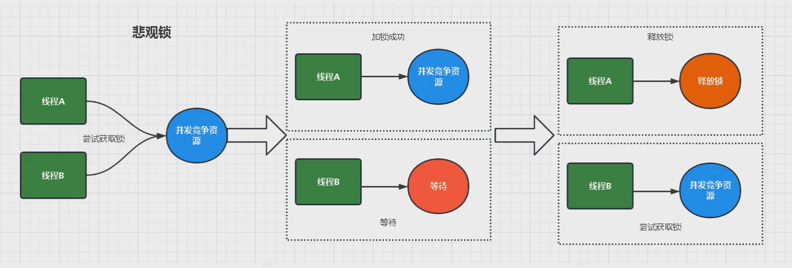

认为自己在使用数据的时候一定有别的线程来修改数据，因此在获取数据的时候会先加锁，确保数据不会被别的线程修改。

synchronized关键字和Lock的实现类都是悲观锁

适合写操作多的场景，先加锁可以保证写操作时数据正确。

显示的锁定之后再操作同步资源

```java
public synchronized void m1()
{
	//加载后的业务逻辑......
}

//保证多个线程使用的是同一个lock对象的前提下
ReentrantLock lock = new ReentrantLock();
public void m2(){
	lock.lock();
	try{
		//操作同步资源
	}fianlly{
		lock.unlock();
	}
}
```

##### 乐观锁

```java
//=============乐观锁的调用方式
//保证多个线程使用的是同一个AtomicInteger
private AtomicInteger atomicInteger = new AtomicInteger();
atomicInteger.incrementAndGet();
```

​	乐观锁认为自己在使用数据时不会有别的线程修改数据，所以不会加锁，只是在更新数据的时候去判断之前有没有别的线程更新了这个数据。

如果这个数据没有被更新，当前线程将自己修改的数据成功写入。如果数据已经被其他线程更新，则根据不同的实现方式执行不同的操作

乐观锁在Java中是通过使用无锁编程来实现，最常采用的是CAS算法，Java原子类中的递增操作就通过CAS自旋实现的。

适合读操作多的场景，不如锁的特点能够使其读操作的性能大幅提升。

乐观锁则直接去操作同步资源，是一种无锁算法

乐观锁一般有两种实现方式：

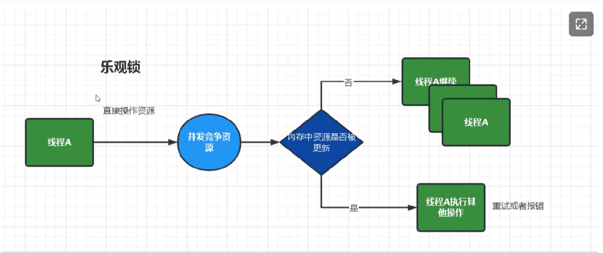

1. 采用版本号机制
2. CAS(Compare-and-Swap,即比较并替换)算法实现

### CAS

多线程环境下不使用原子类保证数据安全（基本数据类型）

```java
public class T3
{
	volatile int number = 0;
	//读取
	public int getNumber()
	{
		return number;
	}
	//写入加锁保证原子性
	public synchronized void setNumber()
	{
		number++;
	}
	//=======================
	AtomicInteger atomicInteger = new AtomicInteger();

	public intgetAtomicinteger()
	{
		return atomicInteger.get();
	}
	public void setAtomicInteger()
	{
		atomicInteger.getAndIncrement();
	}

}
```

#### cas是什么

```
compare and swap的缩写，中文翻译成比较并交换，实现并发算法时常用到的一种技术。它包含三个操作数--内存位置、预期原值及更新值。
执行CAS操作的时候，将内存位置的值与预期原值比较：
如果相匹配，那么处理器会自动将该位置值个更新为新值，
如果不匹配，处理器不做任何操作，多个线程同时执行CAS操作只有一个会成功。
```

CAS有3个操作数，位置内存值V，旧的预期值A，要修改的更新值B。

当前仅当旧的预期值A和内存值V相同时，将内存值V修改为B，否则什么都不做或重来

```text
CAS是JDK提供的非阻塞原子性操作，它通过硬件保证了比较-更新的原子性。
它是非阻塞的且自身原子性，也就是说这玩意效率更高且通过硬件保证，说明这玩意更可靠。

CAS是一条CPU的原子指令（cmpxchg指令），不会造成所谓的数据不一致问题，Unsafe提供的CAS方法（如compareAndSwqpXXX）底层实现即为CPU指令cmpxchg。
执行cmpxchg指令的时候，会判断当前系统是否为多核系统，如果是就给总线加锁，只有一个线程会对总线加锁成功，加锁成功之后会执行cas操作，也就是说CAS的原子性实际上是CPU实现的，其实在这一点上还是有排他锁的，只是比起用synchronized，这里的排他时间要短的多，所以在多线程情况下性能会比较好
```

```java
public class CASDemo
{
	public static void main(String[] args)throws InterruptedException
	{
		AtomicInteger atomicInteger = new AtomicInteger(5);

		System.out.println(atomicInteger.compareAndSet(5, 2020) + "\t" + atomicInteger.get());
        System.out.println(atomicInteger.compareAndSet(5, 1024) + "\t" + atomicInteger.get());
	}
}
```

#### 源码分析compareAndSet(int expect,int update)

compareAndSet()方法的源代码

```
public final native boolean compareAndSwapObject(Object var1,long var2,Object var4,Object var5);
public final native boolean compareAndSwapObject(Object var1,long var2,int var4,int var5);
public final native boolean compareAndSwapObject(Object var1,long var2,long var4,long var6);
```

上面三个方法都是类似的，主要对4个参数做一下说明。

var1：表示要操作的对象

var2：表示要操作对象中属性地址的偏移量

var4：表示需要修改数据的期望的值

var5/var6：表示需要修改为的新值

#### CAS底层原理？如果知道，谈谈你对Unsafe的理解

CAS（Compare and Swap）是一种无锁算法，其主要原理是在硬件层面实现的，一般情况下包含三个操作数：内存位置 V、旧的预期值 A 和新值 B。
当且仅当 V 的值等于 A 时，才会将 V 的值修改为 B。这是一个原子操作，意味着在多线程环境下不会出现数据竞争等问题。

`Unsafe` 是 Java 提供的一个可以方便地进行低级内存操作的类，其功能非常强大，包括但不限于直接访问对象字段、分配内存、设置对象头、执行 CAS 操作等。

简单来说，`Unsafe` 类的存在就是为了绕过 JVM 对对象的一些保护措施，使得开发者可以直接操作内存。比如在 JUC 包中的很多并发工具类都是依赖 `Unsafe` 来实现高效且线程安全的操作。

但是需要注意的是，`Unsafe` 类的功能过于强大，如果不熟悉其实现机制和使用场景的话很容易引发难以察觉的安全隐患和性能问题，因此在实际开发中应该尽量避免直接使用 `Unsafe` 类，而是选择更高级别的并发工具类来进行编程。

#### CAS的缺点

循环时间长开销很大

我们可以看到getAndAddInt方法执行时，有个do while

如果CAS失败，会一直进行尝试。如果CAS长时间一直不成功，可能会给CPU带来很大的开销。

### 自旋锁，借鉴CAS思想

自旋锁（spinlock）：是指当一个线程在获取锁的时候，如果锁已经被其它线程获取，那么该线程将循环等待，然后不断的判断是否能够成功获取，直到获取到锁才会退出循环。

自旋锁与互斥锁比较类似，它们都是为了解决对某项资源的互斥使用。无论是互斥锁，还是自旋锁，在任何时刻，最多只能有一个保持者，也就是说，任何时刻最多只能有一个执行单元获得锁。

对于互斥锁，会让没有得到锁资源的线程进入**BLOCKED**状态，然后在争夺到锁资源后恢复为**RUNNABLE**状态，这个过程中涉及到操作系统用户模式和内核模式的转换，代价比较高。但是自旋锁不会引起调用者堵塞，如果自旋锁已经被别人的执行单元保持，调用者就一直循环在那里看是否该自旋锁的保持者已经释放了锁。

**自旋锁的实现基础是CAS算法机制。**CAS自选锁属于乐观，乐观地认为程序中的并发情况不那么严重，所以让线程不断去尝试更新。

### ABA问题

假设这样一种场景，当地一个线程执行CAS(V,E,U)操作。在获取到当前变量V，准备修改为新值U前，另外两个线程已经连续修改了两次变量V的值，使得该值又恢复为旧值，这样的话，我们就无法正确判断这个变量是否被修改过，如下图：

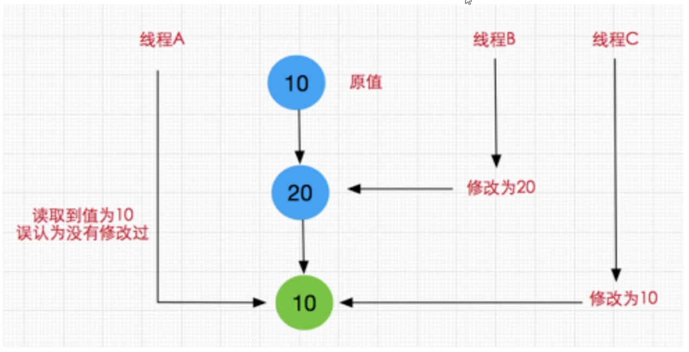

### wait/sleep的区别

整体区别其实是有四个：

1、**所属类不同：**sleep是线程中的方法，但是wait是Object中的方法。

2、**语法不同：**sleep方法不依赖于同步器synchronized，但是wait需要依赖synchronized关键字。

3、**参数不同：**sleep必须设置参数时间，wait可以不设置时间，不设置将一直休眠。

4、**释放锁资源不同：**sleep方法不会释放lock，但是wait会释放，而且会加入到等待队列中。

5、**唤醒方式不同：**sleep不需要被唤醒（休眠之后退出阻塞），但是wait需要（不指定时间需要被别人中断）。

6、**线程进入状态不同：**调用sleep方法线程会进入TIMED_WAITING有时限等待状态，而调用无参的wait方法，线程会进入WAITING无限时等待状态。

### 生产者消费者模式

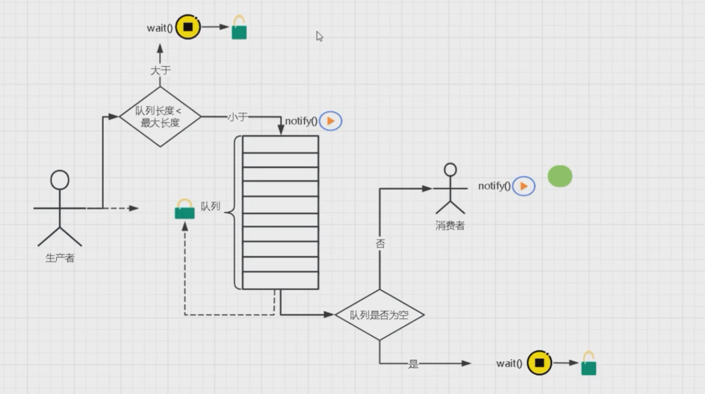

### synchronized锁升级

其实在JDK1.6之前，Java内置锁还是一个重量级锁，是一个效率比较低下的锁，会由jvm用户态切换到操作系统的**管程**来实现互斥：

#### 管程（Monitor）概念

- Monitor，直译为“**监视器**”，而操作系统领域系统一般翻译为“**管程**”，在java领域就是“**对象锁**”。
- **管程**是指**管理共享变量**以及**对共享变量操作**的**过程**，让它们**支持并发**。翻译成Java领域的语言，就是**管理类的状态变量，让这个类是线程安全的。**
- synchronized关键字和wait()、notify()、notifyAll()这三个方法是Java中实现管程技术的组成部分。
- Monitor有两大作用：同步和互斥
- wait/notify基于monitor做的，monitor中有owner、entryList、waitSet
- synchronized关联了monitor，是JVM层面实现的，源码是C++

java对象于monitor之间的关系

- 每个Java对象都可以关联一个Monitor对象，如果使用synchronized给对象加锁（重量级锁）之后，该**对象头的Mark Word**中就**被设置Monitor对象的指针。**

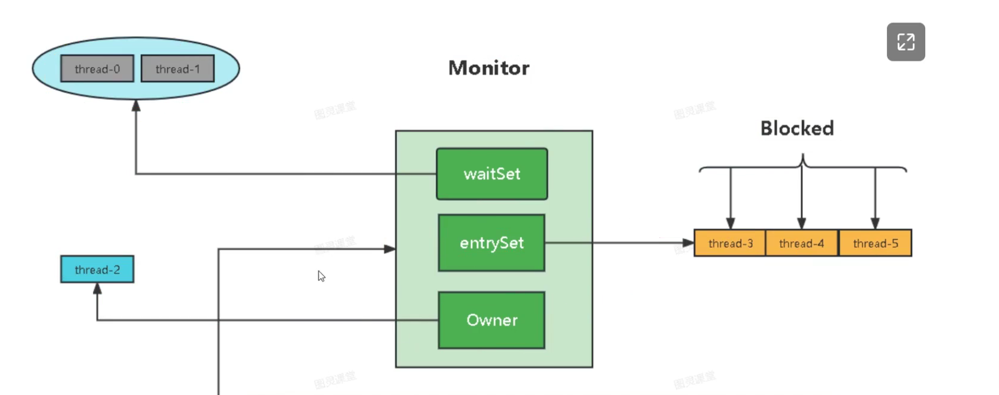

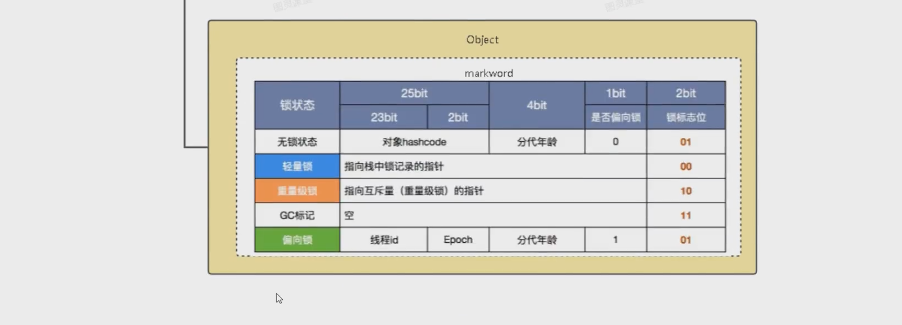

```java
synchronized(obj){
	// 临界区代码
}
```

- 刚开始Monitor中Owner为null
- 当Thread-2执行synchronized(obj)就会将Monitor的所有者Owner置为Thread-2,Monitor中只能有一个Owner
- 在Thread-2上锁的过程中，如果Thread-3,Thread-4,Thread巧也来执行synchronized(obj),就会进入EntryList,此时线程状态变为BLOCKED状态
- Thread-2执行完同步代码块的内容，然后唤醒EntryList中等待的线程来竞争锁，竞争是非公平的(synchronized是非公平锁）
- WaitSet中的Thread-0,Thread-1是之前获得过锁的线程，此时的状态是WAITING状态，后面讲wait-notify时会分析

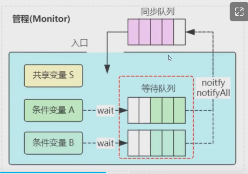

#### 锁升级

在JK1.6之后，JVM为了提高锁的获取与释放效率，对synchronized的实现进行了优化，引入了偏向锁和轻量级锁，从此以后Java内置锁的状态就有了4种（无锁、偏向锁、轻量级锁和重量级锁），并且4种状态会随着竞争的情况逐渐升级，而且是不可逆的过程，即不可降级，也就是说只能进行锁升级（从低级别到高级别）级别由低到高依次为：**无锁一>偏向锁一>轻量级锁一>重量级锁。**

##### markWord

如果了解对象的内存布局的可以忽略此段。这个对象的内存分布是和JVM的实现有关。

当一个对象被创建出来后它在内存中的布局如下，由四部分组成：

- 8个字节的markword，（markword里面包含了其它的东西，比如GC标记，锁类型）
- 4个字节的ClassPoint（此指针指向的Class），默认是开启指针压缩所以是四个字节，关闭指针压缩后是8个字节
- 实例对象中的成员属性大小
- 字节填充（有的JVM需要8字节对齐，如果上面的字节相加后不能被8整除，则需要在此补齐）


现在有一个Java类T，将它new 出来之后它的对象的内存布局是什么样子的呢？

```java
class T{
	Integer age;
}
```

可以通过一个小工具来查看下这个T类在内存中的对象布局

```xml
<dependency>
	<groupId>org.openjdk.jol</groupId>
	<artifactId>jol-core</artifactId>
	<version>0.9</version>
	<scope>compile</scope>
</dependency>
```

##### 无锁

```text
锁对象刚被创建，没有任何线程竞争，对象处于无锁状态+不可偏向状态
大小端转换：00000001
偏向锁位(biased_lock)bit+锁标志位(lock)2bit = 0 01
```

```java
T o = new T();
System.out.println(ClassLayout.parseInstance(o).toPrintable());
```

##### 偏向锁存

jdk中偏向锁存在延迟4秒启动，也就是说在jvm启动后4秒后创建的对象才会开启偏向锁，可以通过jvm参数取消这个延迟时间

创建的对象状态为 对象处于无锁状态+可偏向状态

偏向锁位(biased-lock)lbit+锁标志位(Iock)2bit = 1 01


**在没有线程竞争的条件下**，第一个获取锁的线程通过CAS将自己的threadId写入到该对象的mark word中，若后续该线程再次获取锁，需要比较当前线程threadId和对象mark word中的threadld是否一致，如果一致那么可以直接获取，并且锁对象始终保持对该线程的偏向，也就是说**偏向锁**不会主动释放

```java
public static void main(String[] args){
	UserTest userTest = new UserTest();

	synchronized(userTest){
		System.out.println(ClassLayout.parseInstance(userTest).toPrintable);
	}
	synchronized(userTest){
		System.out.println(ClassLayout.parseInstance(userTest).toPrintable);
	}
}
```

**当两个或以上线程** **交替获取锁，但并没有在对象上并发的获取锁时，**偏向锁升级为**轻量级锁**。在此阶段，线程采取CAS的自旋方式尝试获取锁，避免阻塞线程造成的cpu在用户态和内核态间转换的消耗

主线程首先对user对象加锁，首次加锁为101偏向锁

子线程等待主线程释放锁后，对user对象加锁，这时将偏向锁升级为00轻量级锁

轻量级锁解锁后，user对象无线程竞争，恢复为001无锁态，并且处于不可偏向状态。如果之后有线程再尝试获取user对象的锁，会直接加轻量级锁，而不是偏向锁

```java
public static void main(String[] args) throws InterruptedException {
	final UserTest userTest = new UserTest();

    synchronized(userTest){
        System.out.println("Main = "+ClassLayout.parseInstance(userTest));
    }
    Thread thread = new Thread(new Runnable(){
       public void run() {
           synchronized (userTest){
               System.out.println("Thread = "+ClassLayout.parseInstance(userTest).toPrintable);
           }
       }
    });
    thread.start();
    thread.join();
    System.out.println("End = "+ClassLayout.parseInstance(userTest).toPrintable);
}
```

**两个或以上线程**井发的在同一个对象上进行同步时，为了避免无用自旋消耗cpu，轻量级锁会升级成重量级锁。这时mark word中的指针指向的是monitor对象（也被称为管程或监视器锁）的起始地址

```java
	new Thread(new Runnable() {
    	@Override
		public void run() {
			synchronized(userTest){
				System.out.println("Thread1 = "+ClassLayout.parseInstance(userTest).toPrintabble);
				try{
					Time.Unit.SECONDS.sleep(2);
            	}catch(InterruptedException e){
            		e.printStackTrace();
            	}
			}
		}
	}).start();
	new Thread(new Runnable() {
    	@Override
		public void run() {
			synchronized(userTest){
				System.out.println("Thread2 = "+ClassLayout.parseInstance(userTest).toPrintabble);
				try{
					Time.Unit.SECONDS.sleep(2);
            	}catch(InterruptedException e){
            		e.printStackTrace();
            	}
			}
		}
	}).start();
try{
    TimeUnit.SECONDS.sleep(4);
}catch(InterruptedException e){
    e.printStackTrace();
}
System.out.println("main:"+ClassLayout.parseInstance(o).toPrintable());
```

### 可重入锁（又名递归锁）

是指在同一个线程在外层方法获取锁的时候，再进入该线程的内层方法会自动获取锁（前提，锁对象得是同一个对象），不会因为之前已经获取过还没释放而阻塞。

如果是1个有synchronized修饰的递归调用方法，程序第2次进入被自己阻塞了岂不是天大的笑话，出现了作茧自缚。所以Java中ReentrantLock和synchronized都是可重入锁，可重入锁的一个优点是可一定程度避免死锁。

### ReentrantLock

Sync是隐式锁。Lock是显示锁

ReentrantLock是Lock的默认实现，在聊ReentranLock之前，我们需要先弄清楚一些概念：

1.可重入锁：可重入锁是指同一个线程可以多次获得同一把锁；ReentrantLock和关键字Synchronized都是可重入锁

2.可中断锁：可中断锁时子线程在获取锁的过程中，是否可以相应线程中断操作。synchronized是不可中断的，ReentrantLock是可中断的

3.公平锁和非公平锁：公平锁是指多个线程尝试获取同一把锁的时候，获取锁的顺序按照线程到达的先后顺序获取，而不是随机插队的方式获取。synchronized是非公平锁，而ReentrantLock是两种都可以实现，不过默认是非公平锁

#### ReentrantLock锁申请等待限时

申请锁等待限时是什么意思？一般情况下，获取锁的时间我们是不知道的，synchronized关键字获取锁的过程中，只能等待其他线程把锁释放之后才能够有机会获取到锁。所以获取锁的时间有长有短。如果获取锁的时间能够设置超时时间，那就非常好了。

ReentrantLock刚好提供了这样功能，给我们提供了获取锁限时等待的方法tryLock()，可以选择传入时间参数，表示等待指定的时间，无参则表示立即返回锁申请的结果：true表示获取锁成功，false表示获取锁失败。

### tryLock

```java
	public static class T extends Thread{
        private static ReentrantLock lock1 = new ReentrantLock(false);
        public T(String name){
            super(name);
        }
        @Override
        public void run(){
            try {
                System.out.println(System.currentTimeMillis()+":"+this.getName()+"开始获取锁!");
                // tryLock 尝试获取锁，如果锁被占用，返回false。 没有占用返回true 指定获取锁的等待时间
                if (lock1.tryLock()) {
                    System.out.println(System.currentTimeMillis()+":"+this.getName()+"获取到了锁!");
                    //获取倒锁后，休眠5秒
                    TimeUnit.SECONDS.sleep(5);
                }else {
                    System.out.println(System.currentTimeMillis()+":"+this.getName()+"未能获取到锁!");
                }
            } catch (InterruptedException e) {
                throw new RuntimeException(e);
            }finally {
                if (lock1.isHeldByCurrentThread()) {
                    lock1.unlock();
                }
            }
        }
    }

    public static void main(String[] args) {
        T t1 = new T("t1");
        T t2 = new T("t2");
        t1.start();
        t2.start();
    }
```

```text
1700663163568:t2开始获取锁!
1700663163568:t1开始获取锁!
1700663163724:t1未能获取到锁!
1700663163724:t2获取到了锁!
```

### ReentrantLock获取锁的过程是可以中断的

对于synchronized关键字，如果一个线程在等待获取锁，最终只有2种结果：

1.要么获取到锁然后继续后面的操作

2.要么一直等待，直到其他线程释放锁为止

而ReentrantLock提供了另外一种可能，就是在等待获取锁的过程中（**发起获取锁请求到还未获取到锁这段时间内**）是可以被中断的，也就是说在等待锁的过程中，程序可以根据需要取消获取锁的请求。有些使用这个操作是非常有必要的。比如：你和好朋友越好一起去打球，如果你等了半小时朋友还没到，突然你接到一个电话，朋友由于突发状况，不能来了，那么你一定达到回府。中断操作正是提供了一套类似的机制，如果一个线程正在等待获取锁，那么它依然可以收到一个通知，被告知无需等待，可以停止工作了。

```java
import java.util.concurrent.TimeUnit;
import java.util.concurrent.locks.ReentrantLock;

public class Demo6 {
    private static ReentrantLock lock1 = new ReentrantLock(false);
    private static ReentrantLock lock2 = new ReentrantLock(false);

    public static class T extends Thread{
        int lock;
        public T(String name,int lock){
            super(name);
            this.lock=lock;
        }

        @Override
        public void run() {
            try {
                if (this.lock == 1) {
                    lock1.lockInterruptibly();
                    TimeUnit.SECONDS.sleep(1);
                    lock2.lockInterruptibly();
                }else {
                    lock2.lockInterruptibly();
                    TimeUnit.SECONDS.sleep(1);
                    lock1.lockInterruptibly();
                }
            } catch (InterruptedException e) {
                System.out.println("中断标志:"+this.isInterrupted());
                e.printStackTrace();
            }finally {
                if (lock1.isHeldByCurrentThread()) {
                    lock1.unlock();
                }
                if (lock2.isHeldByCurrentThread()) {
                    lock2.unlock();
                }
            }
        }


    }
    public static void main(String[] args) throws InterruptedException{
        T t1 = new T("t1", 1);
        T t2 = new T("t2", 2);
        t1.start();
        t2.start();
        TimeUnit.SECONDS.sleep(5);
        t2.interrupt();
    }
}

```

```tex
中断标志:false
java.lang.InterruptedException
at           java.base/java.util.concurrent.locks.AbstractQueuedSynchronizer.doAcquireInterruptibly(AbstractQueuedSynchronizer.java:944)
at java.base/java.util.concurrent.locks.AbstractQueuedSynchronizer.acquireInterruptibly(AbstractQueuedSynchronizer.java:1263)
at java.base/java.util.concurrent.locks.ReentrantLock.lockInterruptibly(ReentrantLock.java:317)
at Demo6$T.run(Demo6.java:25)
```

1. ReentrankLock中必须使用实例方法`locklnterruptibly()`获取锁时，在线程调用interrupt0方法之后，才会引发InterruptedException异常
2. 线程调用interrupt()之后，线程的中断标志会被置为true
3. 触发InterruptedException异常之后，线程的中断标志会被清空，即置为false
4. 所以当线程调用interrupt()引发InterruptedException异常，中断标志的变化是：false·>true->false

### 公平锁和非公平锁

在大多数情况下，锁的申请都是非公平的，也就是说，线程1首先请求锁A，接着线程2也请求了锁A。那么当锁A可用时，是线程1可获得锁还是线程2可获得锁呢？这是不一定的，系统只是会从这个锁的等待队列中随机挑选一个，因此不能保证其公平性。这就好比买票不排队，大家都围在售票窗囗前，售票员忙的焦头烂额，也顾及不上谁先谁后，随便找个人出票就完事了，最终导致的结果是，有些人可能一直买不到票。而公平锁，则不是这样，它会按照到达的先后顺序获得资源。公平锁的一大特点是：它不会产生饥饿现象，只要你排队，最终还是可以等到资源的；synchronized关键字默认是有jvm内部实现控制的，是非公平锁。而ReentrantLock运行开发者自己设置锁的公平性。

```java
public ReentrantLock(){
	sync = new NonfairSync();
}
public ReentrantLock(boolean fair){
	sync = fair ? new FairSync() : new NonfairSync();
}
```

#### 为什么会有公平锁/非公平锁的设计为什么默认非公平

1、恢复挂起的线程到真正锁的获取还是有时间差的，从开发人员来看这个时间微乎其微，但是从CPU的角度来看，这个时间差存在的还是很明显的。所以**非公平锁能更充分的利用CPU的时间片，尽量减少CPU空闲状态时间。**

2、使用多线程很重要的考量点是**线程切换的开销**，当采用非公平锁时，当1个线程请求锁获取同步状态，然后释放同步状态，因为不需要考虑是否还有前驱节点，所以刚释放锁的线程在此刻再次获取同步状态的概率就变得非常大，所以就减少了线程的开销。

#### 使用公平锁会有什么问题

公平锁保证了排队的公平性，非公平锁霸气的忽视这个规则，所以就有可能导致排队的长时间在排队，也没有机会获取到锁，这就是传说中的“锁饥饿"

#### 什么时候用公平？什么时候用非公平？

如果为了更高的吞吐量，很显然非公平锁是比较合适的，因为节省很多线程切换时间，吞吐量自然就上去了；否则那就用公平锁，大家公平使用。

### 共享锁和排他锁

#### 排他锁

排它锁又称独占锁，获得了以后既能读又能写，其他没有获得锁的线程不能读也不能写，典型的synchronized就是排它锁

#### 共享锁

共享锁又称读锁，获得了共享锁以后可以查看但无法修改和删除数据，其他线程也能获得共享锁，也可以查看但不能修改和删除数据

在没有读写锁之前，我们虽然保证了线程安全，但是也浪费了一定的资源，因为多个读操作同时进行并没有线程安全问题

ReentrantReadWriteLock中读锁就是共享锁，写锁是排它锁，在读的地方使用读锁，在写的地方使用写锁，灵活控制，如果不这样，读是无限阻塞的，这样提高了程序的执行效率

### synchronized与Lock的区别

1.首先synchronized是java内置关踺字，在jvm层面，Lock是个java类；

2.synchronized无法判断是否获取锁的状态，Lock可以判断是否获取到锁；

3.synchronized会自动释放锁(a线程执行完同步代码会释放锁；b线程执行过程中发生异常会释放锁)lL。ck需在fina日y中手工释放锁（unlock()方法释放锁），否则容易造成线程死锁；

4.用synchronized关踺字的两个线程1和线程2，如果当前线程1获得锁，线程2线程等待。如果线程1阻塞，线程2则会一直等待下去，而Lock锁就不一定会等待下去，如果尝试获取不到锁，线程可以不用一直等待就结束了；

5.synchronized的锁可重入、不可中断、非公平，而Lock锁可重入、可中断、可公平（两者皆可）

> Lock中断方式
>
> 1：调用设置超时方法tryLock(long timeout,timeUnit unit)
>
> 2：调用lockInterruptibly()放到代码块中，然后调用interrupt()方法可以中断

6.Lock锁适合大量同步的代码同步问题，synchronized锁适合代码少量的同步问题。

