# 
# 连接数据库
    mysql -h ip -P port -u user -p
    
    password
## DDL

    show databases; -- 显示所有数据库
    
    select database(); -- 查询当前数据库
    
    create database [if not exists] 数据库名 [default charset 字符集] [collate 排序规则]; -- 创建数据库
    
    drop database [if exist]; -- 删除数据库
    
    use 数据库名; -- 使用数据库
    
    show tables; -- 查询当前数据库所有表
    
    desc 表名; -- 查询表结构
    
    show create table 表名; -- 查询指定表建表语句
    
    create table 表名(
    
        column_name column_type
    
        -- id int unsigned not null comment '编号'
    
    ); 
    -- 创建表
    
    alter table 表名 add 字段名 类型(长度) [comment 注释] [约束]; -- 添加字段
    
    alter table 表名 modify 字段名 新数据类型(长度); -- 修改字段数据类型
    
    alter table change 旧字段名 新字段名 类型(长度) [comment 注释] [约束]; -- 修改字段名及字段数据类型
    
    alter table drop 字段名; -- 删除字段
    
    alter table 表名 rename to 新表名; -- 修改表名
    
    drop table [if exist] 表名; -- 删除表
    
    truncate table 表名; -- 删除并重建表

## DML

    insert into 表名(字段1,字段2,....) values(值1,值2,...); -- 指定字段添加数据
    
    insert into 表名 values(值1,值2,...); -- 给全部字段添加数据
    
    insert into 表名(字段1,字段2,....) values(值1,值2,...),(值1,值2,...),...(值1,值2,...),(值1,值2,...); -- 批量添加指定字段数据
    
    insert into 表名 values(值1,值2,...),(值1,值2,...),...(值1,值2,...),(值1,值2,...); -- 批量添加全部字段数据
    
    update 表名 set 字段1=值1,字段2=值2,...[where 条件]; -- 更新字段数据类型
    
    delete from 表名 [where 条件]; -- 删除数据


## DQL


    select distinct 字段 from 表名 where 条件列表 group by 分组字段列表 having 分组后条件列表 order by 排序字段列表 desc/asc  limit 分页参数;//条件查询
    
    select 字段1,字段2,字段3...from 表名; -- 查询多个字段
    
    select * from 表名;// 
    
    select 字段1 [as 别名1],字段2 [别名2],... from 表名; -- 设置别名
    
    select  distinct 字段列表 from 表名; -- 查询 去重
    
    select 字段列表 from 表名 where 条件列表; -- 条件 ( >  >=  <  <=  =  (<>  !=)  between...(小)and...(大)  in(...)(多选一)    like    is null  (and &&) (or ||)  (not !) )

聚合函数 
    
    count sum min max avg
    
    select count/sum/min/max/avg(字段名) from 表名 ...

执行顺序    
    
    from-where-group by-having-select-order by-limit


## DCL


    use mysql; -- 使用mysql数据库
    
    select * from user; -- 查询用户
    
    create user '用户名'@'主机名' identified by '密码'; -- 创建用户
    
    alter user '用户名'@'主机名' identified with mysql_native_password by '新密码'; -- 更改用户密码
    
    drop user '用户名'@'主机名'; -- 删除用户


    show grants for '用户名'@'主机名'; -- 查询权限
    
    grant 权限名 on 数据库.表名 to '用户名'@'主机名'; -- 授权
    
    revoke 权限名 on 数据库.表名 from '用户名'@'主机名'; -- 撤销权限
    
    concat(S1,S2,...Sn)  -- 字符串拼接，将s1，s2，...sn拼接成一个字符
    
    lower(str)  -- 小写
    
    upper(str)  -- 大写
    
    lpad(str,n,pad)  -- 左填充pad
    
    rpad(str,n,pad)  -- 右填充pad
    
    trim(str)  -- 去除头部尾部空格
    
    substring(str,start,len)  -- start->start+len字符串截取
    
    ceil(x) -- 向上取整
    
    floor(x)  -- 向下取整
    
    mod(x,y)  -- x/y的余数
    
    rand() -- 返回(0,1)之间的随机数
    
    round(x,y)  -- 求x四舍五入的值，保留y位小数


    curdate() -- 返回当前日期
    
    curtime() -- 返回当前时间
    
    now() -- 返回当前时间日期
    
    year(date)  -- 获取日期中的年
    
    month(date)  -- 获取日期中的月
    
    day(date)   -- 获取日期中的日
    
    date_add(date,interval expr type)
    
    datediff(date1,date2) //返回date1到date2的天数
    
    if(value,t,f)  //value为true 返回 t 否则返回 f
    
    ifnull(value1,value2) //value1为不为空 返回value1 否则 返回value2
    
    case when [var1] then [res1]...else [default] end  -- var1为true 返回res1 否则 返回default默认值(固定值)
    
    select case when id = 1 then 1 else 2 end;
    
    case [expr] when [var1] then [res1] ... else [default] end -- 非固定
    
    select case id when 1 then 1 else 2 end;


## 约束

    非空约束 not null
    
    唯一约束 unique
    
    主键约束 primary key
    
    默认约束 default [默认为1]
    
    检查约束 check
    
    外键约束 foreign key
## 多表关系
    一对多：在多的一方设置外键，关联一的一方的主键
    
    多对多：建立中间表，中间表包含两个外键，关联两张表的主键
    
    一对一：用于表结构拆分，在其中任何一方设置外键（UNIQUE），关联另一方的主键

##  多表查询

## 内连接 [交集部分]

隐式内连接 

    select 字段列表 from 表1,表2 where 条件...;

显示内连接

    select 字段列表 from 表1 [inner] join 表2 on 条件列表...;  
    -- [inner]可省略

## 外连接 

左外连接

    select 字段名称 from 表1 left [outer] join 表2 on 条件...;  
    -- [outer] 可省略

右外连接

    select 字段名称 from 表1 right [outer] join 表2 on 条件...;  
    -- [outer] 可省略

## 自连接

    select 字段名称 from 表A 别名A join 表A 别名B on 条件...;
    -- 自连接查询，可以是内连接查询，也可以是外连接查询。

## 联合查询

    select 字段名称 from 表A ...
    
        union [ALL]
    
    select 字段名称 from 表B ...; 
    -- 上下合并 查询字段的数量和类型必须相同 union ALL直接合并 union 去重

## 子查询 [嵌套查询]

    select * from 表1 where column1 = (select column1 from 表2);
    -- 子查询外部语句可以是insert/update/delete/select的任何一个。
### 根据子查询结果不同，分为:
    标量子查询（子查询结果为单个值）
    
    列子查询（子查询结果为一列）
    
    行子查询（子查询结果为一行）
    
    表子查询（子查询结果为多行多列）

### 标量子查询 
    =、<>、>、>=、<、<=
### 列子查询
    IN -- 在指定的集合范围内，多选一
    
    NOT IN -- 不在指定的集合范围之内
    
    ANY -- 子查询返回列表中，有任意一个满足即可
    
    SOME -- 与ANY等同，使用SOME的地方可以使用ANY
    
    ALL -- 子查询返回列表的所有值都必须满足
### 行子查询
    =、<>、IN、NOT IN 
### 表子查询
    IN
## 事务
###

#### 事务 是一组操作的集合，它是一个不可分割的工作单位，事务会吧所有的操作作为一个整体一起想系统提交或撤销操作请求，即这些操作要么同时成功，要么同时失败。
###

### 事务操作
    select @@autocommit;
    
    set @@autocommit = 0;
    
    -- 查看/设置事务提交方式
    
    commit;
    
    -- 提交事务
    
    rollback;
    
    -- 回滚事务
### 事务四大特性
    原子性:事务是不可分割的最小操作单元，要么全部成功，要么全部失败。
    一致性:事务完成时，必须使所有的数据都保持一致的状态。
    隔离性:数据库系统提供隔离机制，保证事务在不受外部并发操作影响的独立环境下运行。
    持久性:事务一旦提交或回滚，它对数据库中的数据的改变就是永久的。
### 并发事务问题
    脏读:一个事务读到另一个事务还没有提交的数据。
    不可重复读:一个事务先后读取同一条记录，但两次读取的数据不同，称之为不可重复读。
    幻读:一个事务按照条件查询数据时，没有对应的数据行，但是在插入数据时，又发现这行数据已经存在，好像出现了”幻影“。
### 事务隔离级别
 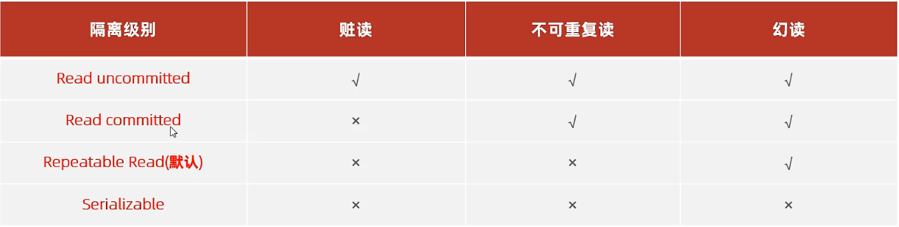
    
    -- 查看事务隔离级别
    
    select @@transaction_isolation;
    
    -- 设置事务隔离级别
    
    set [session|global] transaction isolaction level {read uncommitted | read committed | repe}atable read | serializable}


## 存储引擎
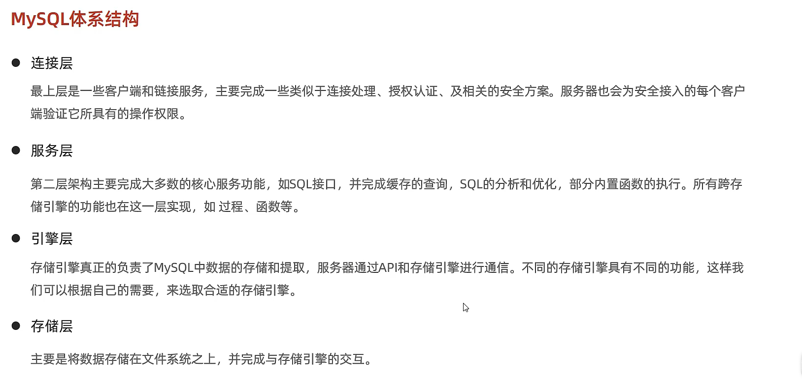

## 存储引擎简介

### 在创建表时，指定存储引擎

    create table 表名
    (
    
        字段1 字段1类型 [comment 字段1注释],
        
        ......
        
        字段n 字段n类型 [comment 字段n注释]
    
    )engine = innodb [comment 表注释]

### 查看当前数据库支持的存储引擎

    show engines;

## 存储引擎特点

### InnoDB

介绍

    InnoDB是一种兼顾高可靠性和高性能的通用存储引擎，在MySQL5.5之后，InnoDB是默认的MySQL存储引擎。

特点

    DML操作遵循ACID模型，支持事务;
    行级锁，提高并发访问性能;
    支持外键FOREIGNKEY约束，保证数据的完整性和正确性;

文件

    xxx.ibd:xxx代表的是表名，innoDB引擎的每一张表都会对应这样一个空间文件，存储该表的表结构（frm、sdi）、数据和索引。
    参数：innodb_file_per_table
    
    show variables like 'innodb_file_per_table';
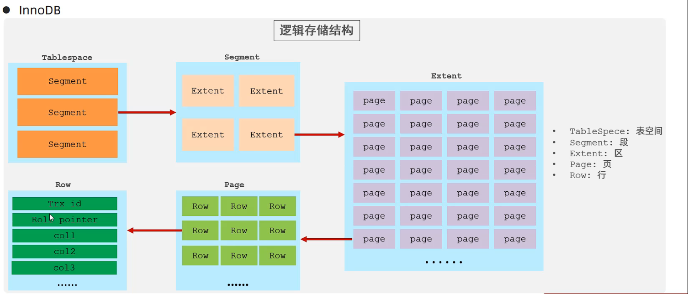
    -- 区:1M-64页-页:16k

### MyISAM

介绍

    MyISAM是MySQL早期的默认存储引擎。

特点

    不支持事务，不支持外键
    支持表锁，不支持行锁
    访问速度快

文件

    xxx.sdi: 存储表结构信息
    xxx.MYD: 存储数据
    xxx.MYI: 存储索引

###  Memory

介绍

    Memory引擎的表数据时存储再内存中的，由于收到硬件影响、或断电问题的影响，只能将这些表作为临时表或缓存表使用。

特点

    内存存放
    hash索引(默认)

文件

    xxx.sdi: 存储表结构信息

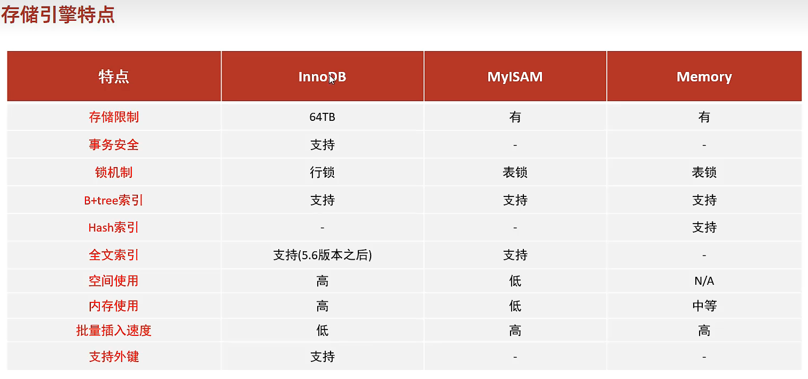

## 存储引擎选择

### 在选择存储引擎时，应该根据应用系统的特点选择合适的存储引擎。对于复杂的应用系统，还可以根据实际情况选择多种存储引擎进行组合。

    InnoDB: 是MySQL的默认存储引擎，支持事务、外键。如果是应用对事物的完整性有比较高的要求，再并发条件下要求数据一致性，数据操作除了插入和查询之外，还包含很多的更新、删除操作，那么InnoDB存储引擎是比较合适的选择。
    
    MyISAM: 如果应用是以读操作和插入操作为主，只有很少的更新和删除操作，并且事务的完整性、并发性要求不是很高，那么选择这个存储引擎是非常合适的。
    
    MEMORY: 将所用数据保存再内存中，访问速度快，通常用于临时表及缓存。MEMORY的缺陷就是对表的大小有限制，太大的表无法缓存在内存中，而且无法保证数据的安全性。

## MySQL安装(linux版)

    密码等级
    
    政策             执行的测试
    
    0或者LOW         长度
    
    1或者MEDIUM      长度；数字、小写/大写和特殊字符
    
    2或者STRONG      长度；数字、小写/大写和特殊字符；字典文件
       
    设置密码等级
    
    set global validate_password.policy = 0;
    
    设置密码长度
    
    set global validate_password.length = 4;

## 索引

### 索引概述

```text
介绍

索引（index）是帮助MySQL高效获取数据的数据结构（有序）。在数据之外，数据库系统还维护着满足特定查找算法的数据结构，这些数据结构以某种方式引用（指向）数据，这样就可以在这些数据结构上实现高级查找算法，这种数据结构就是索引。
```

### 演示

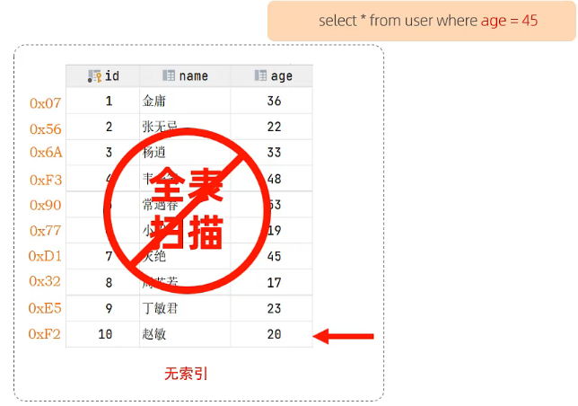

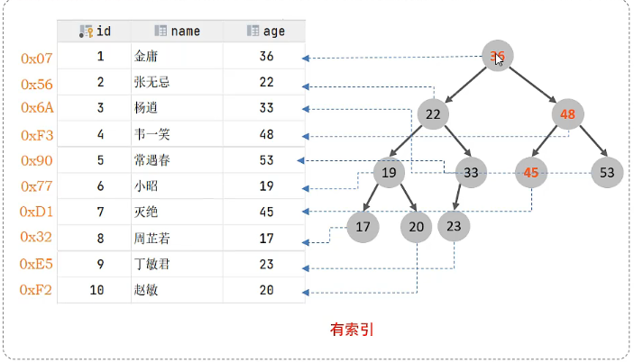

##### 优缺点

|                            优势                             |                             劣势                             |
| :---------------------------------------------------------: | :----------------------------------------------------------: |
|           提高数据检索的效率，降低数据库的IO成本            |                    索引列也是要占用空间的                    |
| 通过索引列对数据进行排序，降低数据排序的成本，降低CPU的消耗 | 索引大大提高了查询效率，同时却也降低更新表的速度，如对表进行INSERT、UPDATE、DELETE时，效率降低。 |

### 索引结构

MySQL的索引是在存储引擎层实现的，不同的存储引擎有不同的结构，包含以下几种：

|       索引结构        |                             描述                             |
| :-------------------: | :----------------------------------------------------------: |
|      B+Tree索引       |            最常见的索引类型，大部分都支持B+树索引            |
|       Hash索引        | 底层数据结构是用哈希表实现的，只有精确匹配索引列的查询才有效，不支持范围查询 |
|  R-Tree（空间索引）   | 空间索引是MyISAM引擎的一个特殊索引类型，主要用于地理数据类型，通常使用较少 |
| Full-text（全文索引） | 是一种通过建立倒排序索引，快速匹配文档的方式。类似于Lucene，Solr，ES |

- B-Tree（**多路**平衡查找树）

  以一颗最大度数（max-degree）为5（5阶）的b-tree为例（每个节点最多存储4个key，5个指针）：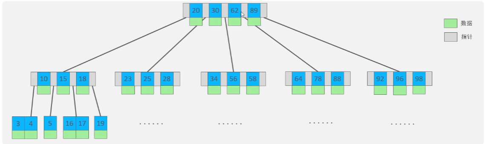[B树](https://www.cs.usfca.edu/~galles/visualization/BTree.html)

- B+Tree

  以一颗最大度数（max-degree）为4（4阶）的b+tree为例：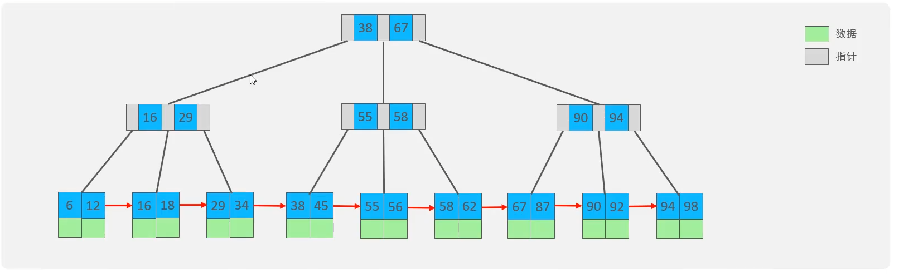[B+树](https://www.cs.usfca.edu/~galles/visualization/BPlusTree.html)

  相对于B-Tree区别：

  - 所有的数据都会出现在叶子节点

  - 叶子节点形成一个单向链表
  - MySQL索引数据结构对经典的B+Tree进行优化。在原B+Tree的基础上，增加一个指向相邻叶子节点的链表指针，就形成了带有顺序指针的B+Tree，提高区间访问的性能。

- Hash

  哈希表索引就是采用一定的hash算法，将键值换算成新的hash值，映射到对应的槽位上，然后存储在hash表中。

  如果两个（或多个）键值，映射到一个相同的槽位上，他们就产生了hash冲突（也称hash碰撞），可以通过链表来解决。

  Hash索引的特点

  1. Hash索引只能用于对等比较（=，in)，不支持范围查询（between, >, <, ...）
  2. 无法利用索引完成排序操作
  3. 查询效率高，通常只需要一次检索就可以了，效率通常要高于B+tree索引

  存储引擎支持

  在MySQL中，支持hash索引的是Memory引擎，而InnoDB中具有自适应hash功能，hash索引是存储引擎根据B+Tree索引在指定条件下自动构建的。

### 索引分类

|   分类   |                         含义                         |           特点           |  关键字  |
| :------: | :--------------------------------------------------: | :----------------------: | :------: |
| 主键索引 |               针对于表中主键创建的索引               | 默认自动创建，只能有一个 | PRIMARY  |
| 唯一索引 |           避免同一个表中某数据列中的值重复           |        可以有多个        |  UNIQUE  |
| 常规索引 |                   快速定位特定数据                   |        可以有多个        |          |
| 全文索引 | 全文索引查找的是文本中的关键字，而不是比较索引中的值 |        可以有多个        | FULLTEXT |

在InnoDB存储引擎中，根据索引的存储形式，又可以分为以下两种：

|            分类             |                            含义                            |         特点         |
| :-------------------------: | :--------------------------------------------------------: | :------------------: |
| 聚集索引（Clustered Index） | 将数据存储与索引放到了一块，索引结构的叶子节点保存了行数据 | 必须有，而且只有一个 |
| 二级索引（Secondary Index） | 将数据与索引分开存储，索引结构的叶子节点关联的是对应的主键 |     可以存在多个     |

聚集索引选取规则：

- 如果存在主键，主键索引就是聚集索引。
- 如果不存在主键，将使用第一个唯一索引（UNIQUE）索引作为聚集索引。
- 如果表没有主键，或没有合适的唯一索引，则InnoDB会自动生成一个rowid作为隐藏的聚集索引。

### 索引语法

- 创建索引

  ```mysql
  CREATE [UNIQUE|FULLTEXT] INDEX index_name ON table_name (index_col_name,...);
  ```

- 查看索引

  ```mysql
  SHOW INDEX FROM table_name;
  ```

- 删除索引

  ```mysql
  DROP INDEX index_name ON table_name;
  ```

### SQL性能分析

- SQL执行频率

  MySQL客户端连接成功后，通过show [session|global] status命令可以提供服务器 状态信息。通过如下指令，可以查看当前数据库的INSERT、UPDATE、DELETE、SELECT的访问频次：

  ```mysql
  SHOW GLOBAL STATUS LIKE 'Com_______';
  ```

- 慢查询日志

  慢查询日志记录了所有执行时间超过指定参数（long_query_time,单位：秒，默认10秒）的所有SQL语句的日志。

  MySQL的慢查询日志默认没有开启，需要在MySQL的配置文件（/etc/my.conf）中配置如下信息：

  ```config
  #开启MySQL慢日志开关
  show_query_log=1
  #设置慢日志的时间为2秒，SQL语句执行时间超过2秒，就会视为慢查询，记录慢查询日志
  long_query_time=2
  ```

  配置完毕之后，通过以下指令重启MySQL服务器进行测试，查看慢日志文件中记录的信息/var/lib/mysql/localhost-show.log。

- profile详情

  show profile能够在做SQL优化时帮助我们了解时间都耗费到哪里去了。通过have_profiling参数，能够看到当前MySQL是否支持profile操作：

  ```mysql
  SELECT @@have_profiling;
  ```

  默认profile是关闭的，可以通过set语句在session/global级别开启profiling：

  ```mysql
  SET profiling=1;
  ```

  执行一系列的业务SQL操作，然后通过如下指令查看指令的执行耗时：

  ```mysql
  #查看每一条SQL的耗时基本情况
  show prifiles;
  
  #查看指定query_id的SQL语句各个阶段的耗时情况
  show profile for query query_id;
  
  #查看指定query_id的SQL语句CPU的使用情况
  show profile cpu for query query_id;
  ```

- explain执行计划

  EXPLAIN或者DESC命令获取MySQL如何执行SELECT语句的信息，包括在SELECT语句执行过程中表如何连接和连接的顺序。

  语法：

  ```mysql
  # 直接在select语句之前加上关键字explain/desc
  EXPLAIN SELECT 字段列表 FROM 表明 WHERE 条件;
  ```

  EXPLAIN执行计划各字段的含义：

  - id

    select 查询的序号，表示查询中执行select子句或者是操作表的顺序（id相同，执行顺序从上到下；id不同，值越大，越先执行）。

  - select_type

    表示SELECT的类型，常见的取值有SIMPLE（简单表，即不使用表连接或者子查询）、PRIMARY（主查询，即外层的查询）、UNION（UNION中的第二个或者后面的查询语句）、SUBQUERY（SELECT/WHERE之后包含了子查询）等

  - type

    表示连接类型，性能由好到差的连接类型为NULL、system、const、eq_ref、ref、range、index、all。

  - possible_key

    显示可能应用在这张表的索引，一个或多个。

  - Key

    实际使用的索引，如果为NULL，则没有使用索引。

  - Key_len

    表示索引中使用的字节数，该值为索引字段最大可能长度，并非实际使用长度，在不损失精确性的前提下，长度越短越好。

  - rows

    MySQL认为必须要执行查询的行数，在InnoDB引擎中的表中，是一个估计值，可能并不总是准确的。

  - filtered

    查询返回结果的行数占读取行数的百分比，filtered的值越大越好。

### 索引使用

- 验证索引效率

  在未建立索引之前，执行如下SQL语句，查看SQL的耗时。

  ```mysql
  SELECT * FROM tb_sku WHERE sn='10000003145001';
  ```

  针对字段创建索引

  ```mysql
  create index idx_sn on tb_sku(sn);
  ```

  然后再次执行相同的SQL语句，再次查看SQL的耗时。

  ```mysql
  SELECT * FROM tb_sku WHERE sn='10000003145001';
  ```

- 最左前缀法则

  如果索引了多列（联合索引），要遵守最左前缀法则。最左前缀法则指的是查询从索引的 最左列开始，并且不跳过索引中的列。

  如果跳跃某一列，**索引将部分失效（后面的字段索引失效）**

- 范围查询

  联合索引中，出现范围查询(>,<)，**范围查询右侧的列索引失效**

- 索引列运算

  不要在索引列上进行运算操作，**索引将失效**。

- 字符串不加引号

  字符串类型字段使用时，不加引号，**索引将失效**。

- 模糊查询

  如果仅仅是尾部模糊匹配，索引不会失效。如果是头部模糊匹配，索引失效。

- or连接的条件

  用or分割开的条件，如果or前的条件中的所有列有索引，而后面的列中没有索引，那么涉及的索引都不会被用到。

- 数据分布影响

  如果MySQL评估使用索引比全表更慢，则不使用索引。

- SQL提示

  SQL提示，是优化数据库的一个重要手段，简单来说，就是在SQL语句中加入一些人为的提示来达到优化操作的目的。

  use index:

  ```mysql
  explain select * from table_name use index(index_name) where <条件>;
  ```

  ignore index:

  ```mysql
  explain select * from table_name ignore index(index_name) where <条件>;
  ```

  force index:

  ```mysql
  explain select * from table_name force index(index_name) where <条件>;
  ```

- 覆盖索引

  尽量使用覆盖索引（查询使用了索引，并且需要返回的列，在该索引中已经全部能够找到），减少select *。
  ```tex
  using index condition : 查找使用了索引，但是需要回表查询
  using where;using index : 查找使用了索引，但是需要的数据都在索引列中能找到，所以不需要回表查询数据
  ```
  
  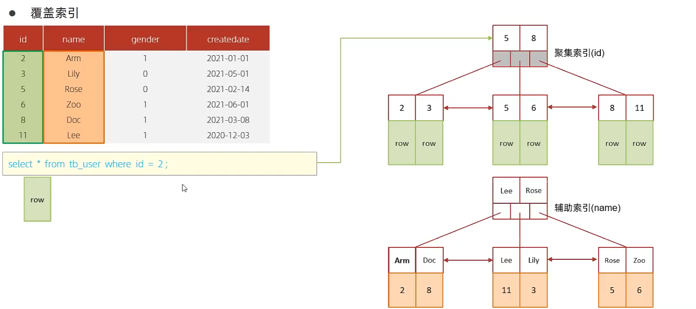
  
  
  
  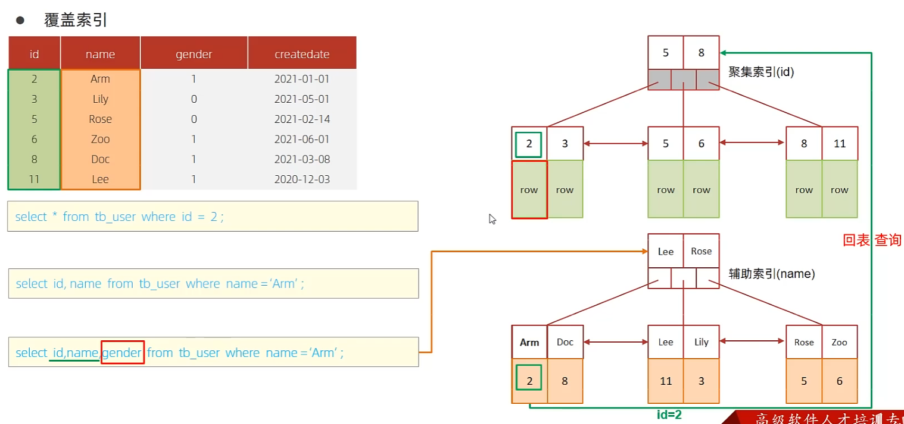

- 前缀索引

  当字段类型为字符串（varchar，text等）时，有时候需要索引很长的字符串，这会让索引变得很大，查询时，浪费大量的磁盘IO，影响查询。此时可以只将字符串的一部分前缀，建立索引，这样可以大大节约索引空间，从而提高索引效率。

  ```mysql
  # 语法
  create index idx_xxxx on table_name(column(n));
  # n为字符数
  ```
  
  前缀长度
  
  可以根据索引的选择性来决定，而选择性是指不重复的索引值，索引选择性越高则查询效率越高，唯一索引的选择性是1，这是最好的索引选择性，性能也是最好的。
  
  ```mysql
  select count(distinct email)/count(*) from tb_user;
  select count(distinct substring(email,1,5))/count(*) from tb_user;
  ```
  
  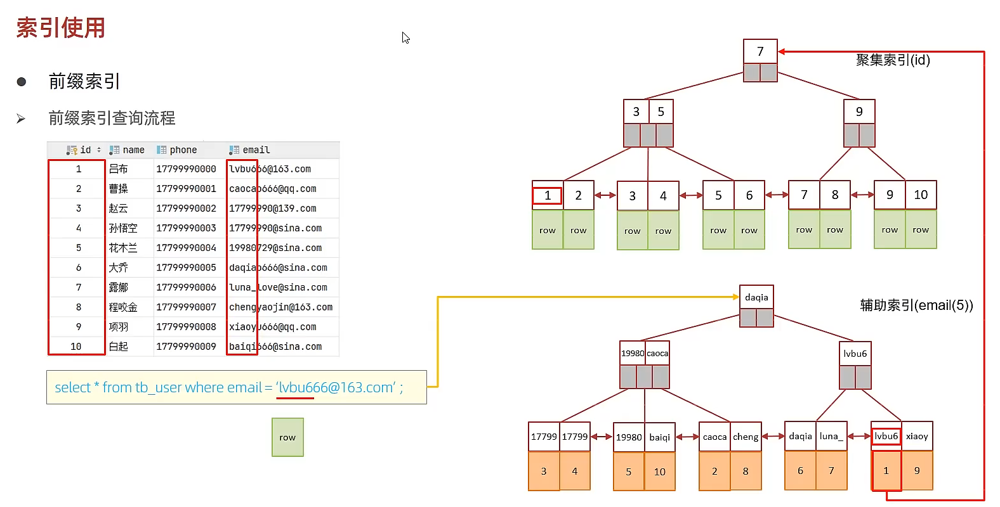

- 单列索引与联合索引

  单列索引：即一个索引只包含单个列。

  联合索引：即一个索引包含了多个列。

  在业务场景中，如果存在多个查询条件，考虑针对于查询字段建立索引时，建议建立联合索引，而非单例索引。

  **多条件联合查询时，MySQL优化器会评估哪个字段的索引效率更高，会选择该索引完成本次查询。**

### 索引设计原则

1. 针对数据量较大，且查询比较频繁的表建立索引。
2. 针对于常作为查询条件（where）、排序（order by）、分组（group by）操作的字段建立索引。
3. 尽量选择区分度高的列作为索引，尽量建立唯一索引，区分度越高，使用索引的效率越高，使用索引的效率越高。
4. 如果是字符串类型的字段，字段的长度较长，可以针对于字段的特点，建立前缀索引。
5. 尽量使用联合索引，减少单列索引，查询时，联合索引很多时候可以覆盖索引，节省存储空间，避免回表，提高查询效率。
6. 要控制索引的数量，索引并不是多多益善，索引越多，维护索引结构的代价就越大，会影响增删改的效率。
7. 如果索引列不能存储NULL值，请在创建表时使用NOT NULL约束它。当优化器知道每列是否包含NULL值时，它可以更好地确定哪个索引最有效地用于查询。

## SQL优化

- insert优化

  批量插入

  ```mysql
  insert into tb_test values(1,'Tom'),(2,'Cat'),(3,'Jerry');
  ```

  手动提交事务

  ```mysql
  start transaction;
  insert into tb_test values(1,'Tom'),(2,'Cat'),(3,'Jerry');
  insert into tb_test values(4,'Tom'),(5,'Cat'),(6,'Jerry');
  insert into tb_test values(7,'Tom'),(8,'Cat'),(9,'Jerry');
  commit;
  ```

  主键顺序插入

  ```tex
  主键乱序插入：8 1 9 21 88 2 4 15 89 5 7 3
  主键顺序插入：1 2 3 4 5 7 8 9 15 21 88 89
  ```

- 大批量插入数据

  如果一次性需要插入大批量数据，使用insert语句性能较低，此时可以使用MySQL数据库提供的load指令进行插入。操作如下：

  ```mysql
  #客户端连接服务端时，加上参数 --local-infile
  mysql --local-infile -u root -p
  #设置全局参数local_infile为1，开启从本地加载文件导入数据的开关
  set global local_infile=1;
  #执行load指令将准备好的数据，加载到表结构中
  load data local infile '/root/sql1.log' into 'tb_user' fields terminated by ',' lines terminated by '\n';
  ```

  主键顺序插入性能高于乱序插入

- 主键优化

  - 数据组织方式

    在InnoDB存储引擎中，表数据都是根据主键顺序组织存放的，这种存储方式的表称为**索引组织表**（index organization table **IOT**）。

  - 页分裂

    页可以为空，也可以填充一半，也可以填充100%。每个页包含了2-N行数据（如果一行数据多大，会行溢出），根据主键排序。

  - 页合并

    当删除一行记录时，实际上记录并没有被物理删除，只是记录被标记（flaged）为删除并且它的空间变得允许被其他记录声明使用。

    当页中删除的记录达到MERGE_THRESHOLD（默认为页的50%），InnoDB会开始寻找最靠近的页（前或后）看看是否将两个页合并以优化使用。

    MERGRE_THRESHOLD：合并页的阈值，可以自己设置，在创建表或者创建索引时指定。

  - 主键设计原则

    满足业务需求的情况下，尽量降低主键的长度。

    插入数据时，尽量选择顺序插入，选择使用AUTO_INCREMENT自增主键。.

    尽量不要使用UUID做主键或者是其他自然主键，如身份证号。

    业务操作时，避免对主键的修改。

- order by优化

  1. Using filesort：通常表的索引或全表扫描，满足条件的数据行，然后在排序缓冲区sort buffer中完成排序操作，所有不是通过索引直接返回排序结果的排序都叫FileSort排序。
  2. Using index：通常有序索引顺序扫描直接返回有序数据，这种情况即为using index，不需要额外排序，操作效率高。

  ```mysql
  #没有创建索引时，根据age，phone进行排序
  explain select id,age,phone from tb_user order by age,phone;
  #创建索引
  create index idx_user_age_phone_aa on tb_user(age,phone);
  #创建索引后，根据age,phone进行升序排序
  explain select id,age,phone from tb_user order by age,phone;
  #创建索引后，根据age，phone进行降序排序
  explain select id,age,phone from tb_user order by age desc,phone desc;
  ```

  根据排序字段建立合适的索引，多字段排序时，也遵循最左前缀法则。

  尽量使用覆盖索引。

  多字段排序，一个升序一个降序，此时需要注意联合索引在创建时的规则（ASC/DESC）。

  如果不可避免的出现filesort，大数据量排序时，可以适当增大排序缓冲区大小sort_buffer_size（默认256k）。

- group by优化

  ```mysql
  #删除掉目前的联合索引 idx_user_pro_sta
  drop index idx_user_pro_sta on tb_user;
  #执行分组操作，根据profession字段分组
  explain select profession,count(*) from tb_user group by profession;
  #创建索引
  Create index idx_user_pro_age_sta on tb_user(profession,age,status);
  #执行分组操作，根据profession字段分组
  explain select profession,count(*) from tb_user group by profession;
  #执行分组操作，根据profession字段分组
  explain select profession,count(*) from tb_user group by profession,age;
  ```

  在分组操作时，可以通过索引来提高效率。

  分组操作时，索引的使用也是满足最左前缀法则的。

- limit优化

  一个常见有非常头疼的问题就是limit 20000000,10，此时需要MySQL排序前2000010记录，仅仅返回2000000-2000010的记录，其他记录丢弃，查询排序的代价非常大。

  优化思路：一般分页查询时，通过创建 覆盖索引 能够此较好地提高性能，可以通过覆盖索引加子查询形式进行优化。

  ```mysql
  explain select * from tb_sku t,(select id from tb_sku order by id limit 2000000,10) a where t.id = a.id;
  ```

- count优化

  ```mysql
  explain select count(*) from tb_user;
  ```

  MyISAM引擎把一个表的总行数存在了磁盘上，因为执行count(*)的时候会直接返回这个数，效率很高；

  InnoDB引擎就麻烦了，它执行count(*)的时候，需要把数据一行一行地从索引里面读出来，然后累积计数。

  优化思路：自己计数。

  - count的几种方法

    count()是一个聚合函数，对于返回的结果集，一行一行地判断，如果count函数的参数不是NULL，累计值就加1，否则不加，最后返回累加值。

    用法：count(*) 、count(主键)、count(字段)、count(1)

    count(主键)

    InnoDB引擎会遍历整张表，把每一行的主键id值取出来，返回给服务层。服务层拿到主键后，直接按行累加(主键不可能为null)。

    count(字段)

    没有not null约束：InnoDB引擎会遍历整张表把每一行的字段值都取出来，返回给服务层，服务层判断是否为null，不为null，计数累加。

    有not null约束：InnoDB引擎会遍历整张表把每一行的字段值都取出来，返回给服务层，直接按行进行累加。

    count(1)

    InnoDB引擎便利整张表，但不取值。服务层对于返回的每一行，放一个数字“1”进去，直接按行进行累加。

    count(*)

    InnoDB引擎并不会把全部字段取出来，而是专门做优化，不取值，服务层直接按行进行累加。

  按照效率排序的话，count(字段)<count(主键id)<count(1)=count(*),所以尽量使用count(*)。

- update优化

  ```mysql
  update table_name set column1=value1 where column2=value2;
  ```

  ```
  update table_name set column1=value1 where column3=value3;
  ```

  InnoDB的行锁是针对索引加的锁，不是针对记录加的锁，并且该索引不能失效，否则会从行锁升级为表锁。

## 视图/存储过程/触发器

### 视图

- 介绍

  视图（View）是一种虚拟存在的表。视图中的数据并不在数据库中实际存在，行和列数据来自定义视图的查询使用的表，并且是在使用视图动态生成的。

  通俗的讲，视图只保存了查询的SQL逻辑，不保存查询的结果。所以我们创建视图的时候，主要的工作就落在创建这条SQL查询语句上。

- 创建

  ```mysql
  CREATE [OR REPLACE] VIEW 视图名称[(列名列表)] AS SELECT语句 [WITH[CASCADED|LOCAL] CHECK OPTION]
  ```

- 查询

  ```mysql
  #查看创建视图语句：
  SHOW CREATE VIEW 视图名称;
  #查看视图数据：
  SELECT * from 视图名称......;
  ```

- 修改

  ```mysql
  CREATE [OR REPLACE] VIEW 视图名称[(列名列表)] AS SELECT语句 [WITH(CASCADED|LOCAL) CHECK OPTION]
  
  ATER VIEW 视图名称[(列名列表)] AS SELECT语句 [WITH[CASCADED|LOCAL] CHECK OPTION]
  ```

- 删除

  ```mysql
  DROP VIEW [IF EXISTS] [视图名称]...
  ```

- 视图的检查选项

  当使用WITH CHECK OPTION子句创建视图时，MySQL会通过视图检查正在更改的每个行，例如插入，更新，删除，以使其符合视图的定义。MySQL允许基于另一个视图创建视图，它还会检查依赖视图中的规则以保持一致性。为了确定检查的范围，mysql提供了两个选项：CASCADED和LOCAL，默认值为CASCADED。

  CASCADED：

  ```mysql
  create view v1 as select id,name from student where id<=20 <with cascaded check option>;
  ```
  ​																				:arrow_up:
  
  ```mysql
  create view v2 as select id,name from v1 where id>=10 with cascaded check option;
  ```
  
  ​																				:arrow_up:
  
  ```mysql
  create view v3 as select id,name from v2 where id<=15;
  ```
  
  LOCAL：
  
  ```mysql
  create view v1 as select id,name from student where id <= 15;
  ```
  
  ​																				:arrow_up:
  
  ```mysql
  create view v2 as select id,name from v1 where id >= 10 [with local check option];
  ```
  
  
  
  ```mysql
  create view v3 as select id,name from v2 where id < 20
  ```

- 视图的更新

  要使视图可更新，视图中的行与基础表中的行之间必须存在一对一的关系。如果视图包含以下任何一项，则该视图不可更新：

  1. 聚合函数或窗口函数(SUM()、MIN()、MAX()、COUNT()等)
  2. DISTINCT
  3. GROUP BY
  4. HAVING
  5. UNION或者UNION ALL

- 作用

  简单

  视图不仅可以简化用户对数据的理解，也可以简化他们的操作。那些被经常使用的查询可以被定义为视图，从而使得用户不必为以后的操作每次指定全部的条件。

  安全

  数据库可以授权，但不能授权到数据库特定行和特定的列上。通过视图用户只能 查询和修改他们所能见到的数据。

  数据独立

  视图可帮助用户屏蔽真实表结构变化带来的影响。

### 存储过程

- 介绍

  存储过程是事先经过编译并存储在数据库中的一段SQL语句的集合，调用存储过程可以简化应用开发人员的很多工作，减少数据在数据库和应用服务器之间的传输对于提高数据处理的效率是有好处的。

  存储过程思想上很简单/就是数据库SQL语言层面的代码封装与重用。

- 特点

  封装，复用

  可以接受参数，也可以返回数据

  减少网络交互，效率提升

- 创建

  ```mysql
  CTREATE PROCEDUER 存储过程名称([参数列表])
  BEGIN
  	--SQL语句
  END;
  ```

- 调用

  ```mysql
  CALL 名称([参数]);
  ```

- 查看

  ```mysql
  SELECT * FROM INFOMATION_SCHEMA.ROUTINES WHERE ROUTINES_SCHEMA='xxx' --查询指定数据库的存储过程及状态
  SHOW CREATE PROCEDUER 存储过程名称; --查询某个存储过程的定义
  ```

- 删除

  ```mysql
  DROP PROUTINES [IF EXISTS] 存储过程名称;
  ```

**注意：在命令行中，执行创建存储过程的SQL时，需要通过关键字delimiter指定SQL语句的结束符。**

- 变量

  **系统变量** 是MySQL服务提供，不是用户定义的，属于服务器层面。分为全局变量(GLOBAL)、会话变量(SESSION)。

  查看系统变量

  ```mysql
  SHOW [SESSION | GLOBAL] VARIABLES;  -- 查看所有系统变量
  SHOW [SESSION | GLOBAL] VARIABLES LIKE '......'; -- 可以通过LIKE模糊匹配方式查找变量
  SELECT @@[SESSION | GLOBAL] 系统变量名; -- 查看指定变量的值
  ```

  设定系统变量

  ```mysql
  SET [ SESSION | GLOBAL ] 系统变量名=值;
  SET @@[SESSION | GLOBAL] 系统变量名=值;
  ```

  **注意：**

  **如果没有SESSION/GLOBAL，默认是SESSION，会话变量。**

  **mysql服务器重新启动之后，所设置的全局参数会失效，要想不失效，可以在/etc/my.cnf中配置。**

  **用户自定义变量** 使用户根据需要自己定义的变量，用户变量不用提前声明，在用的时候直接用“@变量名”使用就可以。其作用域为当前连接。

  赋值

  ```mysql
  SET @var_name = expr [, @var_name = expr]...;
  SET @var_name := expr [, @var_name := expr]...;
  ```

  ```mysql
  SELECT @var_name := expr [,@var_name := expr]...;
  SELECT 字段名 INTO @var_name FROM 表名;
  ```

  使用

  ```mysql
  SELECT @var_name;
  ```

  **注意**

  **用户定义的变量无需对其进行声明或初始化，只不过获取到的值为NULL。**

  **局部变量** 是根据需要定义的在局部生效的变量，访问之前，需要DECLARE声明。可用作存储过程内的局部变量和输入参数，局部变量的范围是在其内部声明的BEGIN..END块

  声明

  ```mysql
  DECLARE 变量名 变量类型[DEFAULT...];
  ```

  变量类型就是数据库字段类型：INT、BIGINT、CHAR、VARCHAR、DATE、TIME等。

  赋值

  ```mysql
  SET 变量名 = 值;
  SET 变量值 := 值;
  SELECT 字段名 INTO 变量名 FROM 表名...;
  ```

- if

  语法

  ```mysql
  IF 条件1 THEN
  	...
  ELSEIF 条件2 THEN        --可选
  	...
  ELSE					--可选
  	...
  END IF;
  ```

  

- 参数

  | 类型  |                     含义                     | 备注 |
  | :---: | :------------------------------------------: | :--: |
  |  IN   |   该类参数作为输入，也就是需要调用时传入值   | 默认 |
  |  OUT  | 该类参数作为输出，也就是该参数可以作为返回值 |      |
  | INOUT |    即可以作为输入参数，也可以作为输出参数    |      |

  用法

  ```mysql
  CREATE PROCEDUER 存储过程名称([IN/OUT/INOUT] 参数名 参数类型)
  BEGIN
  	-- SQL语句
  END;
  ```

- case

  语法一

  ```mysql
  CASE case_value
  	WHEN when_value1 THEN statement_list1
  	[ WHEN when_value2 THEN statement_list 2]...
  	[ELSE statement_list]
  END CASE;
  ```

  语法二

  ```mysql
  CASE
  	WHEN search_condition1 THEN statement_list
  	[WHEN search_condition2 THEN statement_list]...
  	[ELSE statement_list]
  END CASE;
  ```

- while

  while循环是有条件的循环控制语句。满足条件后，再执行循环体中的SQL语句。具体语法为：

  ```mysql
  #先判定条件，如果条件为true，则执行逻辑，否则，不执行逻辑
  WHILE 条件 DO
  	SQ逻辑...
  END WHILE;
  ```

- repeat

  repeat是有条件的循环控制语句，当满足条件的时候退出循环。具体语法为：

  ```mysql
  #先执行一次逻辑，然后判定逻辑是否满足，如果满足，则退出。如果不满足，则继续下一次循环
  REPEAT
  	SQL逻辑...
  	UNTIL条件
  END REPEAT;
  ```

- loop

  LOOP实现简单的循环，如果不在SQL逻辑中增加退出循环的条件，可以用其来实现简单的死循环。LOOP可以配合一下两个语句使用：

  - LEAVE：配合循环使用，退出循环。
  - ITERATE：必须用在循环中，作用是跳过当前循环剩下的语句，直接进入下一次循环。

  ```mysql
  [begin_label:] LOOP
  	SQL逻辑...
  END LOOP [end_label];
  ```

  ```mysql
  LEAVE label; -- 退出指定标记的循环体
  ITERATE label; -- 直接进入下一次循环
  ```

- 游标

  **游标(CURSOR) **是用来存储查询结果集的数据类型，在存储过程和函数中可以使用游标对结果集进行循环的处理。游标的使用包括游标的声明、OPEN、FETCH和CLOSE，其语法分别如下。

  声名游标

  ```mysql
  DECLARE 游标名称 CURSOR FOR 查询语句;
  ```

  打开游标

  ```mysql
  OPEN 游标名称;
  ```

  获取游标记录

  ```mysql
  FETCH 游标名称 INTO 变量[,变量];
  ```

  关闭游标

  ```mysql
  CLOSE 游标名称;
  ```

- 条件处理程序

  **条件处理程序(Handler)** 可以用来定义在流程控制结构执行过程中遇到问题时相应的处理步骤。具体语法为：

  ```mysql
  DECLARE handler_action HANDLER FOR condition_value [,condition_value]... statement;
  
  handler_action
  	CONTINUE:继续执行当前程序
  	EXIT:终止执行当前程序
  condition_value
  	SQLSTATE sqlstate_value:状态码，如02000
  	SQLWARNING:所有以01开头的SQLSTATE代码的简写
  	NOT FOUND:所有以02开头的SQLSTATE代码的简写
  	SQLEXCEPTION:所有没有被SQLWARNING或者NOT FOUND捕获的SQLSTATE代码的简写
  ```

  [服务器错误消息参考](https://dev.mysql.com/doc/mysql-errors/8.0/en/server-error-reference.html)

### 存储函数

存储函数有返回值的存储过程，存储函数的参数只能是IN类型的。具体语法如下:

```
CREATE FUNCTION 存储函数名称([参数列表])
RETURNS type [characteristic...]
BEGIN
	--SQL语句
	RETURN...;
END;
```

characteristic说明:

- DETERMINISTIC：相同的输入参数总是产生相同的结果
- NO SQL：不包含SQL语句。
- READS SQL DATE：包含读取数据语句，但不包含写入数据的语句。

### 触发器

- 介绍

  触发器是与表有关的数据库对象，指在insert/update/delete之前或之后，触发并执行触发器中定义的SQL语句集合。触发器的这种特性可以协助应用在数据库端确保数据的完整性，日志记录，数据校验等操作。

  使用别名OLD和NEW来引用触发器中发生变化的记录内容，这与其他的数据库是相似的。现在触发器还只支持行级触发，不支持语句级触发。

  |   触发器类型   |                       NEW和OLD                       |
  | :------------: | :--------------------------------------------------: |
  | INSERT型触发器 |            NEW表示将要或者已经新增的数据             |
  | UPDATE型触发器 | OLD表示修改之前的数据，NEW表示将要或已经修改后的数据 |
  | DELETE型触发器 |            OLD表示将要或者已经删除的数据             |

- 语法

  创建

  ```mysql
  CREATE TRIGGER trigger_name
  BEFORE/AFTER INSERT/UPDATE/DELETE
  ON tbl_name FOR EACH ROW --行级触发器
  BEGIN
  	trigger_stmt;
  END;
  ```

  查看

  ```mysql
  SHOW TRIGGERS;
  ```

  删除

  ```mysql
  DROP TRIGGER [schema_name.]trigger_name; --如果没有指定schema_name，默认为当前数据库。
  ```

## 锁

### 概述

- **介绍**

  锁是计算机协调多个进程或线程并发访问某一资源的机制。在数据库中，除传统的计算资源(CPU、RAM、I/O)的争用以外，数据也是一种供许多用户共享的资源。如何保证数据并发访问的一致性、有效性是所有数据库必须解决的一个问题，锁冲突也是影响数据库并发访问性能的一个重要因素。从这个角度来说，锁对数据库而言显得尤其重要，也更加复杂。

- 分类

  MySQL中的锁，按照锁的粒度分，分为以下三类：

  1. 全局锁：锁定数据库中的所有表。
  2. 表级锁：每次操作锁住整张表。
  3. 行级锁：每次操作锁住对应的行数据。

### 全局锁

- **介绍**

  全局锁就是对整个数据库例加锁，加锁后整个实例就处于只读状态，后续的DML的写语句，DDL语句，已经更新操作的事务提交语句都将被阻塞。

  其典型的使用场景是做全库的逻辑备份，对所有的表进行锁定，从而获取一致性视图，保证数据的完整性。

- 演示

  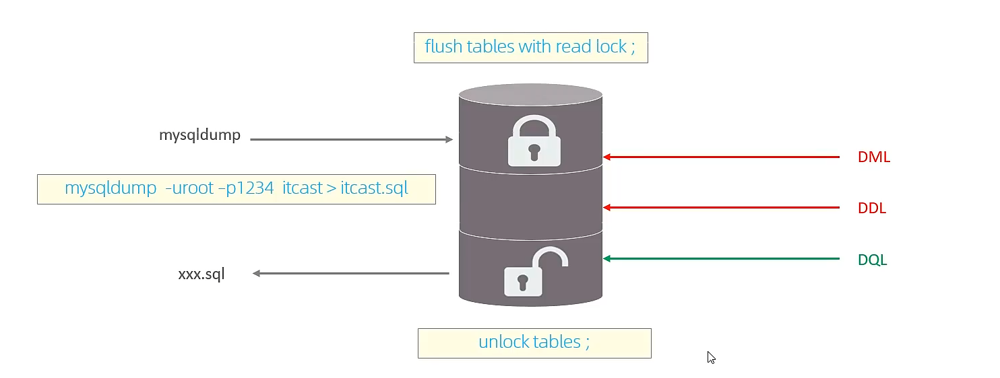

- 特点

  数据库加全局锁，是一个比较重的操作，存在以下问题：

  1. 如果在主库上备份，那么在备份期间都不能执行更新，业务基本上就得停摆。
  2. 如果在从库上备份，那么份期间从库不能执行主库同步过来的二进制日志(binlog)，会导致主从延迟。

  在InnoDB引擎中，我们可以在备份时加上参数 --single-transaction 参数完成不加锁的一致性数据备份。

### 表级锁

- **介绍**

  表级锁，每次操作锁住整张表。锁定粒度大，发生锁冲突的概率最高，并发度最低。应用在MylSAM、lnnoDB、BDB等存储引擎中。

  对于表级锁，主要分为以下三类：

  1. 表锁
  2. 元数据锁（meta data lock，MDL）
  3. 意向锁

- 表锁

  对于表锁，分为两类：

  1. 表共享读锁（read lock）
  2. 表独占写锁（write lock）

  语法：

  1. 加锁：lock tables 表名... read/write。
  2. 释放锁：unlock tables/客户端断开连接。

  **读锁不会阻塞其他客户端的读，但是会阻塞写。写锁既会阻塞其他客户端的读，又会阻塞其他客户端的写。**

- 元数据项（meta data lock，MDL）

  MDL加锁过程是系统自动控制，无需显式使用，在访问一张表的时候会自动加上。MDL锁主要作用是维护表元数据的数据一致性，在表上有活动事务的时候，不可以对元数据进行写入操作。**为了避免DML与DDL冲突，保证读写的正确性。**

  在MySQL5.5中引入了MDL，当对一张表进行增删改查的时候，加MDL读锁(共享)；当对表结构进行变更操作的时候，加MDL写锁（排他）。

  |                   对应SQL                   |                锁类型                |                       说明                       |
  | :-----------------------------------------: | :----------------------------------: | :----------------------------------------------: |
  |         lock tables xxx read/write          | SHARED_READ_ONLY/SHARE_NO_READ_WRITE |                                                  |
  |     selet、select...lock in share mode      |             SHARED_READ              | 与SHARED_READ、SHARED_WRITE兼容，与EXCLUSIVE互斥 |
  | insert、update、delete、select...for update |             SHARED_WRITE             | 与SHARED_READ，SHARED_WRITE兼容，与EXCLUSIVE互斥 |
  |               alter table ...               |              EXCLUSIVE               |                与其他的MDL都互斥                 |

  查看元数据锁：

  ```mysql
  select object_type,object_schema,object_name,lock_type,lock_duration from performance_schema.metadata_locks;
  ```

- 意向锁

  为了避免DML在执行时，加的行锁与表锁的冲突，在InnoDB中引入了意向锁，使得表锁不用检查每行数据是否加锁，使用意向锁来减少表锁的检查。

  1. 意向共享锁（IS）：由语句select....lock in share mode添加。
  2. 意向排他锁（IX）：由insert、update、delete、select... for update添加。

  1. 意向共享锁（IS）：与表锁共享锁（read）兼容，与表锁排它锁（write）互斥。
  2. 意向排他锁（IX）：与表锁共享锁（read）及排他锁（write）都互斥。意向锁之间不会互斥。

  可以通过以下SQL，查看意向锁及行锁的加锁情况：

  ```mysql
  select object_schema,object_name,index_name,lock_type,lock_mode,lock_data from performance_schema.data_locks;
  ```

### 行级锁

- **介绍**

  行级锁，每次操作锁住对应的行数据。锁定粒度最小，发生锁冲突的概率最低，并发度最高。应用在InnoDB存储引擎中。

  InnoDB的数据是基于索引组织的，行锁是通过对索引上的索引项加锁来实现的，而不是对记录加的锁。对于行级锁，主要分为以下三类：

  1. 行锁（Record Lock）：锁定单个行记录的锁，防止其他事务对此行进行update和delete。在RC、RR隔离级别下都支持。
  2. 间隙锁（Gap Lock）：锁定索引记录间隙（不含该记录），确保索引记录间隙不变，防止其他事务在这个间隙进行insert，产生幻读。在RR隔离级别下都支持。
  3. 临键锁（Next-Key Lock）：行锁和间隙锁组合，同时锁住数据，并锁住数据前面的间隙Gap。在RR隔离级别下支持。

- 行锁

  InnoDB实现了以下两种类型的行锁：

  1. 共享锁（S）：允许一个事务去读一行，阻止其他事务获得相同数据集的排它锁。
  2. 排他锁（X）：允许获取排他锁的事务更新数据，阻止其他事务获得相同数据集的共享锁和排他锁。

  | 当前锁类型\请求锁类型 | S（共享锁） | X（排他锁） |
  | :-------------------: | :---------: | :---------: |
  |      S（共享锁）      |    兼容     |    冲突     |
  |      X（排他锁）      |    冲突     |    冲突     |

  |             SQL             |    行锁类型    |                   说明                   |
  | :-------------------------: | :------------: | :--------------------------------------: |
  |          INSERT...          |     排他锁     |                 自动加锁                 |
  |          UPDATE...          |     排他锁     |                 自动加锁                 |
  |          DELETE...          |     排他锁     |                 自动加锁                 |
  |       SELECT（正常）        | **不加任何锁** |                                          |
  | SELECT...LOCK IN SHARE MODE |     共享锁     | 需要手动在SELECT之后加LOCK IN SHARE MODE |
  |     SELECT...FOR UPDATE     |     排他锁     |     需要手动在SELECT之后加FOR UPDATE     |

- 行锁-演示

  默认情况下，lnnoDB在REPEATABLE READ事务隔离级别运行，lnnoDB使用next-key锁进行搜索和索引扫描以防止幻读。

  1. 针对唯一索引进行检索时，对已存在的记录进行等值匹配时，将会自动优化为行锁。
  2. InnoDB的行锁是针对于索引加的锁，不通过索引条件检索数据，那么InnoDB将对表中的所有记录加锁，此时**就会升级为表锁**。

  可以通过以下SLQ，查看意向锁及行锁的加锁情况：

  ```mysql
  select object_schema,object_name,index_name,lock_type,lock_mode,lock_data from performance_schema.data_locks;
  ```

- 间隙锁/临键锁-演示

  默认情况下，InnoDB在REPEATABLE READ事务隔离级别运行，InnoDB使用next-key锁进行搜索和索引扫描/以防止幻读。

  1. 索引上的等值查询（唯一索引)，给不存在的记录加锁时优化为间隙锁。
  2. 索引上的等值查询（普通索弓l)，向右遍历时最后一个值不满足查询需求时，next-key lock退化为间隙锁。
  3. 索引上的范围查询（唯一索弓l)--会访问到不满足条件的第一个值为止。

  **注意：间隙锁唯一目的是防止其他事务插入间隙。间隙锁可以共存，一个事务采用的间隙锁不会阻止另一个事务在同一个间隙上采用间隙锁。**

## InnoDB引擎

### 逻辑存储结构


表空间（ibd文件），一个mysql实例可以对应多个表空间，用于存储记录、索引等数据。

段，分为数据段（Leaf node segment）、索引段（Non-leaf node segment）、回滚段（Rollback segment），InnoDB是索引组织表，数据段就是B+树的叶子节点，索引段即为B+树的非叶子节点。段用来管理多个Extent（区）。

区，表空间的单元结构，每个 区的大小为1M。默认情况下，InnoDB存储引擎页大小为16K，即一个区中一共有64个连续的页。

页，是InnoDB存储引擎磁盘管理的最小单元，每个页的大小默认为16KB。为了保证页的连续性，InnoDB存储引擎每次从磁盘申请4-5个区。

行，InnoDB存储引擎数据是按行进行存放的。（Trx_id：每次对某条记录进行改动时，都会把对应的事务id赋值给trx_id隐藏列。 Roll_pointer：每次对某条引记录进行改动时，都会把旧的版本写入到undo日志中，然后这个隐藏列就相当于一个指针，可以通过它来找到该记录修改前的信息。）

### 架构

MySQL5.5版本开始，默认使用InnoDB存储引擎，它擅长事务处理，具有崩溃恢复特性，在日常开发中使用非常广泛。下面是InnoDB架构图，左侧为内存结构，右侧为磁盘结构。

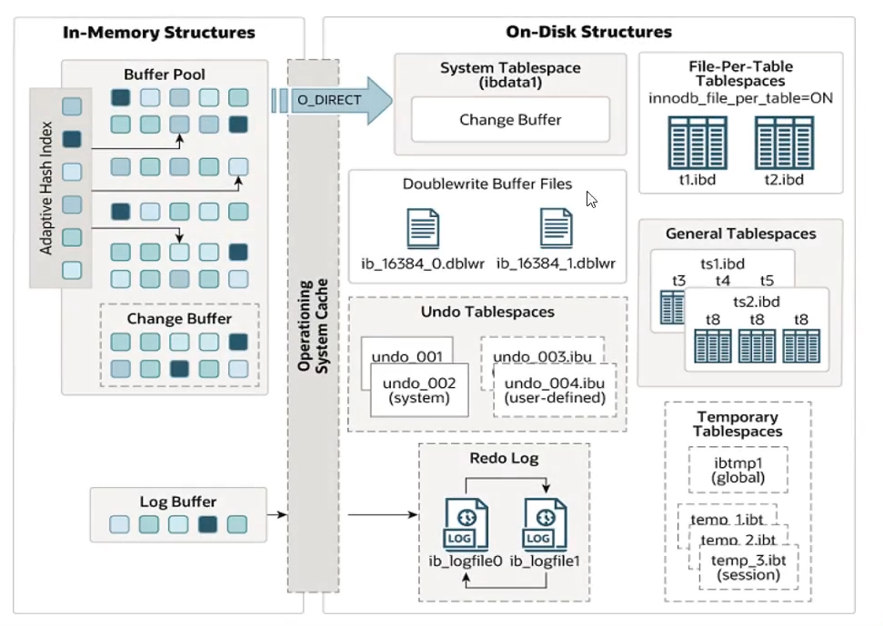

Buffer Pool：缓冲池是主内存中的一个区域，里面可以缓存磁盘上经常操作的真实数据，在执行增删改查操作时，先操作缓冲池的数据（若缓冲池没有数据，则从磁盘加载并缓存），然后再以一定频率刷新到磁盘，从而减少磁盘IO，加快处理速度。

缓冲池以Page页为单位，底层采用链表数据结构管理Page。根据状态，将Page分为三种类型：

- free page：空闲page，未被使用。
- clean page：被使用page，数据没有被修改过。
- dirty page：脏页，被使用page，数据被修改过，页中数据与磁盘的数据产生了不一致。

### 内存结构

Change Buffer：更改缓冲区（针对于非唯一二级索引页），在执行DML语句时，如果这些数据Page没有在Buffer Pool中，不会直接操作磁盘，而会将数据变更存在更改缓冲区Change Buffer中，在未来数据被读取时，再将数据合并恢复到Buffer Pool中，再将合并后的数据刷新到磁盘中。

**Change Buffer的意义是什么？**

与聚集索引不同，二级索引通常是非唯一的，并且以相对随机的顺序插入二级索引。同样，删除和更新可能会影响索引树中不相邻的二级索引页，如果每一次都操作磁盘，会造成大量的磁盘IO。有了Change Buffer之后，我们可以在缓冲池中进行合并处理，减少磁盘IO。

Adaptive Hash Index；自适应hash索引，用于优化对Buffer Pool数据的查询。InnoDB存储引擎会监控对表上各索引页的查询，如果观察到hash索引可以提升速度，则建立hash索引，称之为自适应hash索引。

**自适应哈希索引，无人工干预，是系统根据情况自动完成。**

参数：adaptive_hash_index

Log Buffer：日志缓冲区，用来保存要写入到磁盘中的log日志数（redolog、undolog），默认大小为16MB，日志缓冲区的日志会定期刷新到磁盘中。如果需要更新、插入或删除许多行的事务，增加日志缓冲区的大小可以节省磁盘I/0。

参数：

innodb_log_buffersize：缓冲区大小innodb_flush_log_at_trx_commit：日志刷新到磁盘时机（1：日志在每次事务提交时写入并刷新到磁盘

0：每秒将日志写入并刷新到磁盘一次。

2：日志在每次事务提交写入，并每秒刷新到磁盘一次。）

### 磁盘结构

System Tablespace：系统表空间是更改缓冲区的存储区域。如果表是在系统表空间而不是每个表文件或通用表空间中创建的，它也可能包含表和索引数据。（在MySQL5.x版本中还包含InnoDB数据字典、undolog等）

参数：innodb_data_file_path

File-Per-Table Tablespaces：每个表的文件表空间包含单个InnoDB表的数据和索引，并存储在文件系统上的单个数据文件中。

参数：innodb_file_per_table

General Tablespaces：通用表空间，需要通过CREATE TABLESPACE语法创建通用表空间，在创建表时，可以指定该表空间。

```mysql
-- General Tablespace
CREATE TABLESPACE xxxx ADD DATAFILE 'file_name' ENGINE = engine_name;
-- 创建表
CREATE TABLE xxx ... TABLESPACE ts_name;
```

Undo Tablespaces：撤销表空间，MySQL实例在初始化时会自动创建两个默认的undo表空间（初始大小16M），用于存储undo log日志。

Temporary Tablespaces：InnoDB使用会话临时表空间和全局临时表空间。存储用户创建的临时表等数据。

Doublewrite Buffer Files：双写缓冲区，InnoDB引擎将数据页从Buffer Pool刷新到磁盘前，先将数据页写入双写缓冲区文件中，便于系统异常时恢复数据。

Redo Log：重做日志，是用来实现事务的持久性。该日志文件由两部分组成：重做日志缓冲（redo log buffer）以及重做日志文件（redo log），前者是在内存中，后者在磁盘中。当事务提交之后会把所有修改信息都会存到该日志中，用于在刷新脏页到磁盘时，发生错误时，进行数据恢复使用。

以循环方式写入重做日志文件，涉及两个文件：ib_logfile0、ib_logfile1

### 后台线程

1. **Master Thread**

   核心后台线程，负责调度其他线程，还负责将缓冲池中的数据异步刷新到磁盘中，保持数据的一致性，还包括脏页的刷新、合并插入缓存、undo页的回收。

2. **IO Thread**

   在InnoDB存储引擎中大量使用了AIO来处理IO请求，这样可以极大地提高数据库的性能，而IO Thread主要负责这些IO请求的回调。

   |       线程类型       | 默认个数 |             职责             |
   | :------------------: | :------: | :--------------------------: |
   |     Read thread      |    4     |          负责读操作          |
   |     Write thread     |    4     |          负责写操作          |
   |      Log thread      |    1     |   负责将日志缓冲刷新到磁盘   |
   | Insert buffer thread |    1     | 负责将写缓冲区内容刷新到磁盘 |

3. **Purge Thread**

   主要用于回收事务已经提交了的undo log，在事务提交之后，undo log可能不用了，就用它来回收。

4. **Page Cleaner Thread**

   协助Master Thread刷新脏页到磁盘的线程，它可以减轻Master Thread的工作压力，减少阻塞。

### 事务原理

- 事务

  事务是一组操作的集合，它是一个不可分割的工作单位，事务会把所有的操作作为一个整体一起向系统提交或撤销操作请求，即这些操作要么同时成功/要么同时失败。

- 特性
  - 原子性（Atomicity）：事务是不可分割的最小单元，要么全部成功，要么全部失败。
  - 一致性（Consistency）：事务完成时，必须使所有的数据都保持一致状态。
  - 隔离性（Isolation）：数据库系统提供的隔离机制，保证事务在不受外部并发操作影响的独立环境下运行。
  - 持久性（Durabillity）：事务一旦提交或回滚，它对数据库中的数据的改变就是永久的。

- redo log

  重做日志，记录的是事务提交时数据页的物理修改，是用来实现事务的持久性。

  该日志文件由两部分组成：重做日志缓冲（redo log buffer)以及重做日志文件(redo log file），前者是在内存中，后者在磁盘中。当事务提交之后会把所有修改信息都存到该日志文件中，用于在刷新脏页到磁盘/发生错误时，进行数据恢复使用。

  

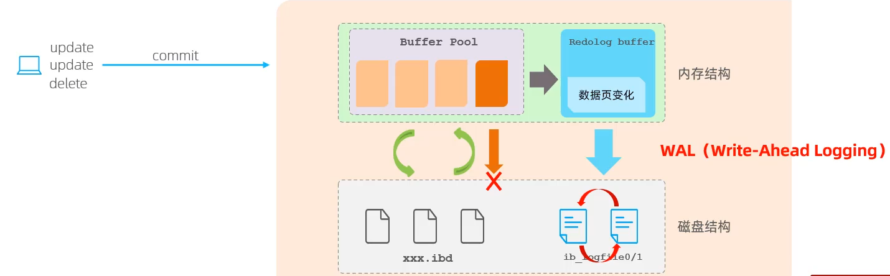

- undo log

  回滚日志，用于记录数据被修改前的信息作用包含两个：提供回滚 和 MVCC（多版本并发控制）。

  undo log和redo log记录物理日志不一样，它是逻辑日志。可以认为当de[ete一条记录时，undo log中会记录一条对应的insert记录，反之亦然，当update—条记录时，它记录一条对应相反的update记录。当执行rollback时，就可以从undo log中的逻辑记录读取到相应的内容并进行回滚。

  Undo log销毁：undo log在事务执行时产生，事务提交时/并不会立即删除undo log因为这些日志可能还用于MVCC。

  Undo log存储：undo log采用段的方式进行管理和记录，存放在前面介绍的rollback segment回滚段中，内部包含1024个undo log segment。

### MVCC

- 当前读

  读取的是记录的最新版本，读取时还要保证其他并发事务不能修改当前记录，会对读取的记录进行加锁。对于我们日常的操作，如：select…lock in share mode(共享锁), select... for update、update、insert、delete(排他锁)都是一种当前读。

- 快照读

  简单的select（不加锁）就是快照读，快照读，读取的是记录数据的可见版本，有可能是历史数据，不加锁，是非阻塞读。

  - Read Committed：每次select，都生成一个快照读。
  - Repeatable Read：开启事务后第一个select语句才是快照读的地方。
  - SeriaIizable:快照读会退化为当前读。

- MVCC

  全称Multi-Version Concurrency Control，多版本并发控制。指维护一个数据的多个版本，使得读写操作没有冲突，快照读为MySQL实现MVCC提供了一个非阻塞读功能。MVCC的具体实现，还需要依赖于数据库记录中的三个隐式字段、undo log日志、read View。

- 记录中的隐藏字段

  | 隐藏的字段  |                             含义                             |
  | :---------: | :----------------------------------------------------------: |
  |  DB_TRX_ID  | 最近修改事务ID，记录插入这条记录或最后一次修改记录的事务ID。 |
  | DB_ROLL_PTR | 回滚指针，指向这条记录的上一个版本，用于配合undo log，指向上一个版本。 |
  |  DB_ROW_ID  |   隐藏主键，如果表结构没有指定主键，将会会生成该隐藏字段。   |

- undo log版本链

  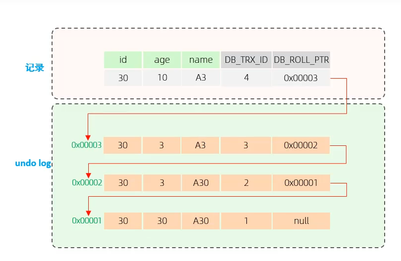

  不同事务或相同事务对同一条记录进行修改，会导致该记录的undolog生成一条记录版本链表，链表的头部是最新的旧记录，链表尾部是最早的旧记录。

- readview

  ReadView（读视图）是**快照读**SQL执行时MVCC提取数据的依据，记录并维护系统当前活跃的事务（未提交的）id。

  ReadView中包了四个核心字段：

  |      字段      |                         含义                         |
  | :------------: | :--------------------------------------------------: |
  |     m_ids      |                 当前活跃的事务ID集合                 |
  |   min_trx_id   |                    最小活跃事务ID                    |
  |   max_trx_id   | 预分配事务ID，当前最大事务ID+1（因为事务ID是自增的） |
  | creator_trx_id |                ReadView创建者的事务ID                |

  trx_id：代表是当前事务ID。

  版本链数据访问规则

  1. trx_id == creator_trx_id ? **可以访问该版本** --> 成立，说明数据是当前这个事务更改的。
  2. trx_id < min_trx_id ? **可以访问该版本** --> 成立，说明数据已经提交了。
  3. trx_id > max_trx_id ? **不可以访问该版本** --> 成立，说明事务是在ReadView生成后才开启。
  4. min_trx_id <= trx_id <= max_trx_id ? 如果trx_id不在m_ids中是**可以**访问该版本的 --> 成立，说明数据已经提交。

  不同的隔离级别，生成ReadView的时机不同：

  READ COMMITTED：在事务中每一次执行快照读时生成ReadView。

  REPEATABLE READ：仅在事务中第一次执行快照读时生成ReadView，后续复用ReadView。

## MySQL管理

### 系统数据库

MySQL数据库安装之后，自带了以下四个数据库，具体作用如下：

|       数据库       |                             含义                             |
| :----------------: | :----------------------------------------------------------: |
|       mysql        | 存储MySQL服务器正常运行所需的各种信息（时区、主从、用户、权限等） |
| information_schema | 提供了访问数据库元数据的各种表和视图，包含数据库、表、字段类型及访问权限等 |
| performance_schema | 为MySQL服务器运行时状态提供了一个底层监控功能，主要用于收集数据库服务器性能参数 |
|        sys         | 包含了一系列方便DBA和开发人员利用performance_schema性能数据库进行性能调优和诊断的视图 |

### 常用工具

- mysql

  该mysql不是指mysql服务，而是指mysql的客户端。

  ```mysql
  语法：
  	mysql [options] [database]
  选项：
  	-u,--user=name            #指定用户名
  	-p,--password[=name]      #指定密码
  	-h,--host=name            #指定服务器IP或域名
  	-P,--port=port            #指定连接端口
  	-e,--execute=name         #执行SQL语句并退出
  ```

  -e选项可以在MySQL客户端执行SQL语句，而不是连接到MySQL数据库再执行，对于一些批处理脚本，这种方式尤其 方便。

  ```mysql
  示例：
  	mysql -u<用户名> -p<密码> <数据库名> -e "select * from <表名>";
  ```

- mysqladmin

  msyqladmin是一个执行管理操作的客户端程序。可以用它来检查服务器的配置和当前状态、创建并删除数据库等。

  通过帮助文档查看选项：

  ```mysql
  mysqladmin --help
  ```

  示例：

  ```mysql
  mysqladmin -u<用户名> -p<密码> drop 'text01';
  mysqladmin -u<用户名> -p<密码> version;
  ```

- mysqlbinlog

  由于服务器生成的二进制日志文件以二进制格式保存，所以如果想要检查这些文本的文本格式，就会使用到mysqlbinlog日志关系工具。

  ```mysql
  语法：
  	mysqlbinlog [options] log-files1 log-files2...
  选项：
  	-d,--database=name           指定数据库名称，只列出指定的数据库相关操作。
  	-o,--offset=#				 忽略掉的日志中qiann行命令。
  	-r,--result-file=name		 将输出的文本格式输出到指定文件。
  	-s,--short-from				 显示简单格式，省略掉一些信息。
  	--start-datatime=date1 --stop-datetime=date2       指定日期间隔内的所有日志。
  	--start-position=pos1 --stop-position=pos2 		   指定位置间隔内的所有日志。
  ```

- mysqlshow

  mysqlshow客户端对象查找工具，用来很快地查找存在哪些数据库、数据库中的表、表中的列或者索引。

  ```mysql
  语法：
  	mysqlshow [options][db_name[table_name[col_name]]]
  选项：
  	--count      显示数据库及表的统计信息(数据，表均不指定)
  	-i           显示指定数据库或者指定表的状态信息
  示例：	
  	#查询每个数据库的表的数量及表中记录的数量
  	mysqlshow -u<用户名> -p<密码> --count
  	
  	#查询test库中每个表中的字段数，及行数
  	mysqlshow -u<用户名> -p<密码> --count
  	
  	#查询test库中book表的详细情况
  	mysqlshow -u<用户名> -p<密码> test book --count
  ```

- mysqldump

  mysqldump客户端工具来备份数据库或者在不同数据库之间进行数据迁移。备份内容包含创建表，及插入表的SQL语句

  ```mysql
  语法：
  	mysqldump [options] db_name [tables]
  	mysqldump [options] --database/-B db1 [db2 db3...]
  	mysqldump [options] --adll-databases/-A
  连接选项：
  	-u,--user=name				指定用户名
  	-p,--password[=name]		指定密码
  	-h,--host=name				指定服务器ip或域名
  	-P,--port=#					指定连接端口
  输出选项：
  	--add-drop-database			在每个数据库创建语句前加上drop database语句
  	--add-drop-table			在每个表创建语句前加上drop table语句，默认开启;不开启(--skip-add-drop-table)
  	-n,--no-create-db			不包含数据库的创建语句
  	-t,--no-create-info			不包含数据库的创建语句
  	-d,--no-data				不包含数据
  	-T,--tab=name				自动生成两个文件：一个.sql文件，创建表结构的语句；一个.txt文件，数据文件
  ```

- mysqlimport/source

  mysqlimport是客户端数据导入工具，用来导入mysqldump加-T参数后导出的文件文本。

  ```mysql
  语法：
  	mysqlimport [options] db_name textfile1 [textfile2...]
  示例：
  	mysqlimport -u<用户名> -p<密码> text /tmp/city.txt
  ```

  如果需要导入sql文件，可以使用mysql中的source指令：

  ```mysql
  语法：
  	source /root/xxxxx.sql
  ```

  
